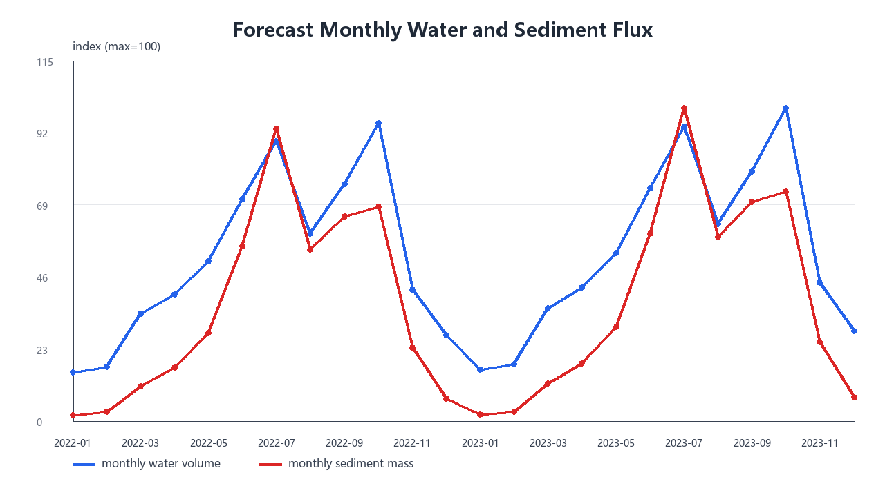
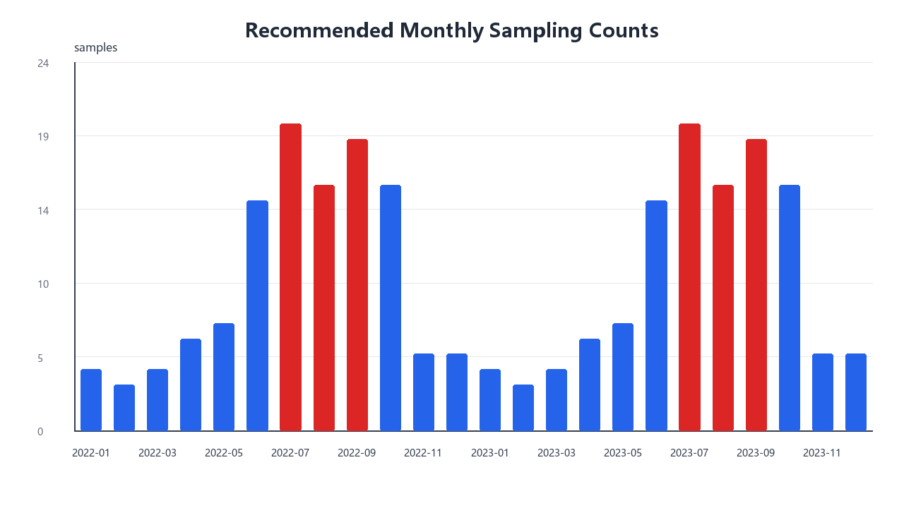

# q3 优化组合预测版本

本版本在独立 `q3-optimized` 文件夹中运行，目标是优化原问题三的主模型，而不是替换为随机森林。模型把近期加权季节模板和 STL 趋势残差模型进行组合，组合权重由 2018-2021 年留一年交叉验证自动确定。

## 模型形式

对每个预测对象分别建立组合预测：

`y_hat = w * y_template + (1 - w) * y_stl`

其中 `w` 为近期加权季节模板权重，`1-w` 为 STL 趋势残差模型权重。水量和输沙通量分别选择权重，避免用同一个权重强行描述不同波动过程。

## 权重选择

| target                  | template_weight | stl_weight | mean_rmse_log |
| ----------------------- | --------------- | ---------- | ------------- |
| mean_flow_m3s           | 1               | 0          | 0.63006       |
| mean_sediment_flux_kg_s | 0.75            | 0.25       | 1.4132        |

## 留一年验证比较

| target                  | model                | heldout_year | rmse_log | mae_log | r2_log      | rmse_original | mae_original |
| ----------------------- | -------------------- | ------------ | -------- | ------- | ----------- | ------------- | ------------ |
| mean_flow_m3s           | cv_weighted_ensemble | mean         | 0.63006  | 0.48567 | -0.00061478 | 921.06        | 593.84       |
| mean_flow_m3s           | seasonal_template    | mean         | 0.63006  | 0.48567 | -0.00061478 | 921.06        | 593.84       |
| mean_flow_m3s           | stl_residual         | mean         | 0.64484  | 0.4953  | -0.029991   | 960.88        | 604.31       |
| mean_sediment_flux_kg_s | cv_weighted_ensemble | mean         | 1.4132   | 1.0951  | -0.023863   | 13291         | 7492.4       |
| mean_sediment_flux_kg_s | seasonal_template    | mean         | 1.4165   | 1.0935  | -0.027075   | 13193         | 7529.1       |
| mean_sediment_flux_kg_s | stl_residual         | mean         | 1.4737   | 1.1492  | -0.070719   | 14246         | 7763.1       |

## 年度预测

| scenario | year | pred_water_volume_1e8_m3 | pred_sediment_mass_1e4_t | pred_mean_flow_m3s | pred_mean_sediment_flux_kg_s | max_pred_flow_m3s | max_pred_sediment_flux_kg_s |
| -------- | ---- | ------------------------ | ------------------------ | ------------------ | ---------------------------- | ----------------- | --------------------------- |
| low      | 2022 | 270.42                   | 12574                    | 857.48             | 3987.2                       | 2075.2            | 22498                       |
| low      | 2023 | 278.65                   | 13122                    | 883.6              | 4160.8                       | 2138.4            | 23474                       |
| normal   | 2022 | 441.88                   | 30098                    | 1401.2             | 9543.9                       | 3071.8            | 29318                       |
| normal   | 2023 | 464.54                   | 32226                    | 1473               | 10219                        | 3229.3            | 31401                       |
| high     | 2022 | 658.14                   | 57564                    | 2087               | 18253                        | 5525.6            | 48056                       |
| high     | 2023 | 697.39                   | 62536                    | 2211.4             | 19830                        | 5867.3            | 52207                       |

## 月度预测图

| year | month | pred_mean_flow_m3s | pred_mean_sediment_flux_kg_s | pred_water_volume_1e8_m3 | pred_sediment_mass_1e4_t |
| ---- | ----- | ------------------ | ---------------------------- | ------------------------ | ------------------------ |
| 2022 | 1     | 413.51             | 503.95                       | 11.076                   | 134.98                   |
| 2022 | 2     | 512.91             | 831.81                       | 12.408                   | 201.23                   |
| 2022 | 3     | 913.54             | 2934.9                       | 24.468                   | 786.07                   |
| 2022 | 4     | 1114.4             | 4617.1                       | 28.885                   | 1196.8                   |
| 2022 | 5     | 1361.6             | 7358.3                       | 36.47                    | 1970.8                   |
| 2022 | 6     | 1950.3             | 15113                        | 50.553                   | 3917.2                   |
| 2022 | 7     | 2381.3             | 24427                        | 63.782                   | 6542.6                   |
| 2022 | 8     | 1596.1             | 14330                        | 42.75                    | 3838.1                   |
| 2022 | 9     | 2085.5             | 17637                        | 54.055                   | 4571.5                   |
| 2022 | 10    | 2535               | 17896                        | 67.898                   | 4793.3                   |
| 2022 | 11    | 1157.2             | 6348.8                       | 29.994                   | 1645.6                   |
| 2022 | 12    | 729.59             | 1864.3                       | 19.541                   | 499.35                   |
| 2023 | 1     | 434.72             | 539.8                        | 11.643                   | 144.58                   |
| 2023 | 2     | 539.21             | 890.92                       | 13.045                   | 215.53                   |
| 2023 | 3     | 960.38             | 3143.9                       | 25.723                   | 842.07                   |
| 2023 | 4     | 1171.5             | 4946.6                       | 30.366                   | 1282.2                   |
| 2023 | 5     | 1431.4             | 7883.4                       | 38.34                    | 2111.5                   |
| 2023 | 6     | 2050.3             | 16186                        | 53.145                   | 4195.3                   |
| 2023 | 7     | 2503.4             | 26155                        | 67.052                   | 7005.3                   |
| 2023 | 8     | 1677.9             | 15332                        | 44.941                   | 4106.5                   |
| 2023 | 9     | 2192.4             | 18879                        | 56.827                   | 4893.5                   |
| 2023 | 10    | 2665               | 19165                        | 71.379                   | 5133.1                   |
| 2023 | 11    | 1216.5             | 6795.4                       | 31.532                   | 1761.4                   |
| 2023 | 12    | 766.99             | 1996.3                       | 20.543                   | 534.69                   |

## 采样方案

采样方案仍以平水情景为基础，综合预测沙通量、偏丰情景通量、通量变化率、汛期/峰值期指标和历史突变月份风险。优化版保留原来的采样逻辑，以便不同模型之间结果可比。

| year | month | samples | high_risk_samples |
| ---- | ----- | ------- | ----------------- |
| 2022 | 1     | 4       | 0                 |
| 2022 | 2     | 3       | 0                 |
| 2022 | 3     | 4       | 0                 |
| 2022 | 4     | 6       | 0                 |
| 2022 | 5     | 7       | 0                 |
| 2022 | 6     | 15      | 0                 |
| 2022 | 7     | 20      | 12                |
| 2022 | 8     | 16      | 4                 |
| 2022 | 9     | 19      | 10                |
| 2022 | 10    | 16      | 0                 |
| 2022 | 11    | 5       | 0                 |
| 2022 | 12    | 5       | 0                 |
| 2023 | 1     | 4       | 0                 |
| 2023 | 2     | 3       | 0                 |
| 2023 | 3     | 4       | 0                 |
| 2023 | 4     | 6       | 0                 |
| 2023 | 5     | 7       | 0                 |
| 2023 | 6     | 15      | 0                 |
| 2023 | 7     | 20      | 13                |
| 2023 | 8     | 16      | 4                 |
| 2023 | 9     | 19      | 10                |
| 2023 | 10    | 16      | 0                 |
| 2023 | 11    | 5       | 0                 |
| 2023 | 12    | 5       | 0                 |

高风险采样日期示例：

| date       | sampling_level | risk_score | pred_mean_flow_m3s | pred_mean_sediment_flux_kg_s | change_strength |
| ---------- | -------------- | ---------- | ------------------ | ---------------------------- | --------------- |
| 2022-07-09 | high           | 0.79669    | 2694.9             | 26357                        | 0.023294        |
| 2022-07-10 | high           | 0.79683    | 2617.7             | 25731                        | 0.024041        |
| 2022-09-20 | high           | 0.79371    | 2124.5             | 18522                        | 0.032865        |
| 2022-09-21 | high           | 0.79944    | 2192.7             | 19163                        | 0.034016        |
| 2022-09-22 | high           | 0.80073    | 2265.6             | 19817                        | 0.033537        |
| 2022-09-23 | high           | 0.79618    | 2340.3             | 20440                        | 0.030972        |
| 2023-07-06 | high           | 0.79397    | 3043.9             | 29967                        | 0.017824        |
| 2023-07-08 | high           | 0.799      | 2911.2             | 28889                        | 0.020828        |
| 2023-07-09 | high           | 0.80373    | 2833.1             | 28222                        | 0.023328        |
| 2023-07-10 | high           | 0.80387    | 2751.9             | 27551                        | 0.024072        |
| 2023-07-11 | high           | 0.79644    | 2672.3             | 26953                        | 0.021964        |
| 2023-07-31 | high           | 0.79755    | 1993               | 21158                        | 0.029345        |
| 2023-08-07 | high           | 0.79502    | 1718.9             | 16222                        | 0.046888        |
| 2023-09-18 | high           | 0.7948     | 2107.6             | 18561                        | 0.032707        |
| 2023-09-19 | high           | 0.79882    | 2167.8             | 19186                        | 0.033126        |
| 2023-09-20 | high           | 0.80074    | 2233.4             | 19828                        | 0.032898        |
| 2023-09-21 | high           | 0.80648    | 2305.2             | 20515                        | 0.034054        |
| 2023-09-22 | high           | 0.80778    | 2381.8             | 21215                        | 0.033579        |
| 2023-09-23 | high           | 0.80324    | 2460.3             | 21883                        | 0.031017        |
| 2023-09-24 | high           | 0.79621    | 2539.4             | 22497                        | 0.02763         |

## 结论

1. 优化模型继承了 STL 模型的趋势解释能力，同时利用近期加权季节模板降低验证误差。
2. 权重由交叉验证确定，避免主观指定模型比例。
3. 偏丰情景加入同月份历史分位数约束，减少短样本外推导致的极端值。
4. 本版本比随机森林更适合作为问题三主模型；随机森林可作为机器学习对照模型保留。
