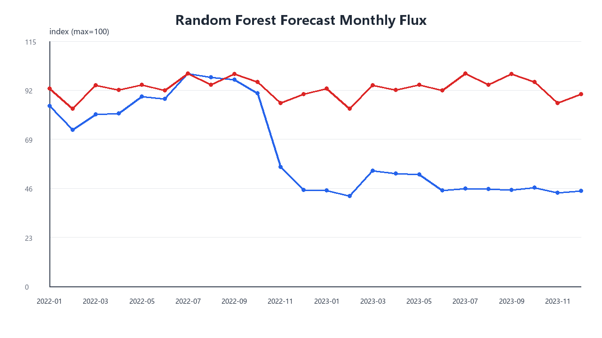
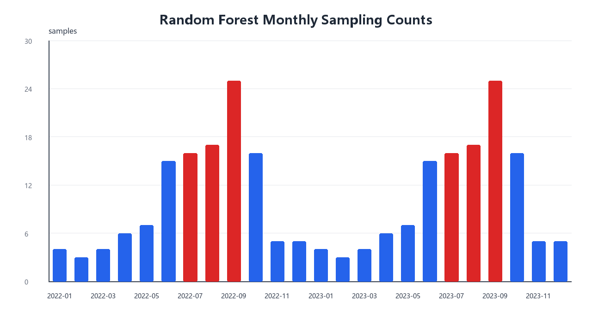

# q3 随机森林预测版本

本版本在独立 `q3` 文件夹中运行，使用纯 numpy 实现的随机森林回归模型。预测对象为 `ln(1+Q_t)` 和 `ln(1+F_t)`，特征包括趋势项、周期项、月份指示变量、汛期指标、滞后项和滚动统计量。

## 验证结果

| target                  | heldout_year | rmse_log | mae_log | r2_log  | rmse_original | mae_original |
| ----------------------- | ------------ | -------- | ------- | ------- | ------------- | ------------ |
| mean_flow_m3s           | mean         | 1.0615   | 0.88608 | -1.6249 | 1291.5        | 873.56       |
| mean_sediment_flux_kg_s | mean         | 2.6979   | 2.3225  | -2.1777 | 16815         | 9617.7       |

## 年度预测

| scenario | year | pred_water_volume_1e8_m3 | pred_sediment_mass_1e4_t | pred_mean_flow_m3s | pred_mean_sediment_flux_kg_s | max_pred_flow_m3s | max_pred_sediment_flux_kg_s |
| -------- | ---- | ------------------------ | ------------------------ | ------------------ | ---------------------------- | ----------------- | --------------------------- |
| low      | 2022 | 94.385                   | 1527                     | 299.29             | 484.2                        | 1073.8            | 4041.1                      |
| low      | 2023 | 67.481                   | 384.29                   | 213.98             | 121.86                       | 225.76            | 130.73                      |
| normal   | 2022 | 341.02                   | 13962                    | 1081.4             | 4427.5                       | 1321.3            | 5037.8                      |
| normal   | 2023 | 195.58                   | 13962                    | 620.18             | 4427.2                       | 741.54            | 5037.8                      |
| high     | 2022 | 965.76                   | 1.0617e+05               | 3062.4             | 33665                        | 4803.3            | 44309                       |
| high     | 2023 | 1284.5                   | 1.1871e+05               | 4073.1             | 37644                        | 4803.3            | 44309                       |

## 月度预测图

## 采样方案

| year | month | samples | high_risk_samples |
| ---- | ----- | ------- | ----------------- |
| 2022 | 1     | 4       | 0                 |
| 2022 | 2     | 3       | 0                 |
| 2022 | 3     | 4       | 0                 |
| 2022 | 4     | 6       | 0                 |
| 2022 | 5     | 7       | 0                 |
| 2022 | 6     | 15      | 0                 |
| 2022 | 7     | 16      | 7                 |
| 2022 | 8     | 17      | 1                 |
| 2022 | 9     | 25      | 19                |
| 2022 | 10    | 16      | 1                 |
| 2022 | 11    | 5       | 0                 |
| 2022 | 12    | 5       | 0                 |
| 2023 | 1     | 4       | 0                 |
| 2023 | 2     | 3       | 0                 |
| 2023 | 3     | 4       | 0                 |
| 2023 | 4     | 6       | 0                 |
| 2023 | 5     | 7       | 0                 |
| 2023 | 6     | 15      | 0                 |
| 2023 | 7     | 16      | 7                 |
| 2023 | 8     | 17      | 1                 |
| 2023 | 9     | 25      | 19                |
| 2023 | 10    | 16      | 1                 |
| 2023 | 11    | 5       | 0                 |
| 2023 | 12    | 5       | 0                 |

