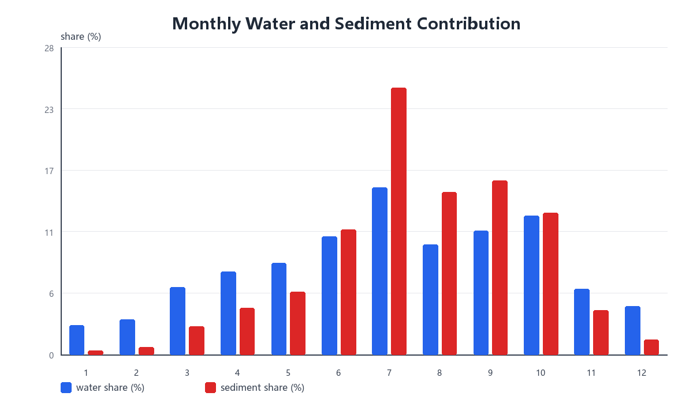
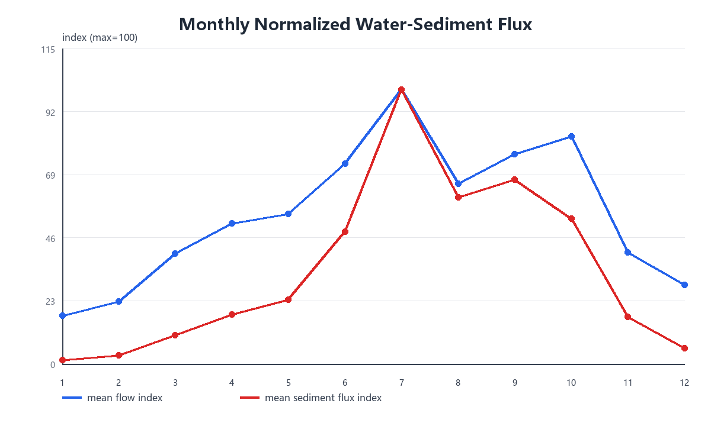

# 问题二完整思路与解题过程

## 1. 问题理解

问题二要求分析近 6 年该水文站水沙通量的突变性、季节性和周期性，并总结水沙通量变化规律。

本题的核心对象有两个：

```text
水通量：Q(t)
沙通量：F_s(t) = Q(t) C(t)
```

其中：

- `Q(t)` 为流量，单位 `m^3/s`；
- `C(t)` 为含沙量，单位 `kg/m^3`；
- `F_s(t)` 为沙通量，单位 `kg/s`。

由于问题一已经对含沙量缺失值进行了补全，因此问题二直接沿用问题一的完整含沙量序列。这样可以保证问题一、问题二中排沙量和沙通量的计算口径一致。

## 2. 数据来源与基本处理

问题二使用问题一输出的清洗后时序文件：

```text
project5/question-1/data/processed/cleaned_hydro_timeseries.csv
```

该文件包含：

```text
datetime
flow_m3s
sediment_used_kgm3
sediment_flux_kg_s
```

其中 `sediment_used_kgm3` 的定义为：

```text
C_used(t_i) =
    C_obs(t_i),  若该时刻有实测含沙量
    C_pred(t_i), 若该时刻含沙量缺失
```

沙通量在原始观测时刻先计算为：

```text
F_s(t_i) = Q(t_i) C_used(t_i)
```

单位换算为：

```text
(m^3/s) × (kg/m^3) = kg/s
```

因此 `F_s(t)` 表示单位时间内通过该水文断面的泥沙质量。

## 3. 时间尺度统一

附件 1 的观测时间间隔不完全一致，存在 1 小时、2 小时、4 小时等不同间隔。为了进行日尺度的突变性、季节性和周期性分析，需要先构造等时间间隔序列。

具体处理为：

1. 将原始时间序列按 `datetime` 排序；
2. 构造 2016-01-01 至 2022-01-01 的完整逐小时时间轴；
3. 将原始观测点与逐小时时间轴合并；
4. 对 `Q(t)`、`C_used(t)` 和 `F_s(t)` 分别按真实时间做线性插值；
5. 取整点小时序列；
6. 按日聚合，得到日均水通量、日均含沙量和日均沙通量。

这里对沙通量采用“先在原始时刻计算 `Q C`，再对沙通量插值”的方式，而不是先分别插值 `Q` 和 `C` 后再相乘。这样可以更直接保留沙通量这一物理量的变化过程。

日尺度变量为：

```text
日均水通量 = mean(Q)
日均含沙量 = mean(C_used)
日均沙通量 = mean(F_s)
```

进一步计算：

```text
日水量 = 日均水通量 × 86400
日排沙量 = 日均沙通量 × 86400
```

## 4. 年际变化分析

按年份汇总日尺度结果：

```text
年总水量 W_y = Σ 日水量
年总排沙量 M_y = Σ 日排沙量
```

并计算同比变化：

```text
水量同比 = (W_y - W_{y-1}) / W_{y-1}
排沙量同比 = (M_y - M_{y-1}) / M_{y-1}
```

得到：

| 年份 | 年水量/亿 m^3 | 年排沙量/万吨 | 水量同比 | 排沙量同比 |
| --- | ---: | ---: | ---: | ---: |
| 2016 | 143.75 | 2322.86 | - | - |
| 2017 | 153.35 | 2351.42 | 6.68% | 1.23% |
| 2018 | 388.91 | 27797.66 | 153.61% | 1082.16% |
| 2019 | 387.21 | 30144.62 | -0.44% | 8.44% |
| 2020 | 433.80 | 36032.04 | 12.03% | 19.53% |
| 2021 | 472.70 | 32734.37 | 8.97% | -9.15% |

可以看出，2016-2017 年水沙通量较低，2018 年开始水通量和沙通量显著增大。2020 年排沙量达到高值，2021 年虽然水量继续增加，但排沙量有所回落。

## 5. 季节性分析

按月份汇总 2016-2021 年所有日数据，计算每个月的：

```text
平均流量
平均沙通量
累计水量
累计排沙量
水量占比
排沙量占比
```

其中：

```text
水量占比 = 该月累计水量 / 六年总水量
排沙量占比 = 该月累计排沙量 / 六年总排沙量
```

为直观展示季节性，绘制月份水量占比和排沙量占比对比图，以及月均水通量和沙通量归一化变化图：





12 个月完整季节性统计如下：

| 月份 | 月均流量/(m^3/s) | 月均沙通量/(kg/s) | 水量占比 | 排沙量占比 | 排沙/水量占比比值 |
| --- | ---: | ---: | ---: | ---: | ---: |
| 1 | 336.39 | 304.26 | 2.73% | 0.37% | 0.14 |
| 2 | 436.00 | 642.75 | 3.23% | 0.72% | 0.22 |
| 3 | 769.24 | 2129.30 | 6.24% | 2.60% | 0.42 |
| 4 | 977.54 | 3661.80 | 7.68% | 4.33% | 0.56 |
| 5 | 1045.83 | 4750.90 | 8.49% | 5.81% | 0.68 |
| 6 | 1397.51 | 9782.12 | 10.98% | 11.58% | 1.05 |
| 7 | 1911.01 | 20249.12 | 15.51% | 24.77% | 1.60 |
| 8 | 1257.51 | 12299.77 | 10.21% | 15.04% | 1.47 |
| 9 | 1459.90 | 13624.51 | 11.47% | 16.13% | 1.41 |
| 10 | 1585.65 | 10741.71 | 12.87% | 13.14% | 1.02 |
| 11 | 778.49 | 3466.50 | 6.12% | 4.10% | 0.67 |
| 12 | 550.26 | 1142.18 | 4.47% | 1.40% | 0.31 |

从全年月份对比可以看出，1-5 月水沙通量整体偏低，6 月开始明显抬升，7 月达到全年最集中的输沙阶段，8-10 月仍保持较高水平，11-12 月逐步回落。7-9 月排沙量占比明显高于水量占比，说明泥沙输移对汛期洪峰过程更加敏感。

进一步统计汛期集中度：

| 时段 | 水量占比 | 排沙量占比 |
| --- | ---: | ---: |
| 6-7 月 | 26.49% | 36.35% |
| 6-10 月 | 61.04% | 80.66% |
| 7 月 | 15.51% | 24.77% |

由此可见，水沙通量具有显著季节性，排沙量比水量更集中于汛期，说明泥沙输移具有更强的脉冲性。若按季节划分，冬季和早春主要为低水低沙期，6 月进入汛期上升阶段，7-9 月为主要输沙期，10 月以后逐渐转入回落阶段。

## 6. 突变性分析

突变性采用 7 日前后滑动均值差识别。

对日尺度水通量和沙通量先作对数变换：

```text
X(t) = ln(1 + F(t))
```

其中 `F(t)` 可以是水通量 `Q(t)`，也可以是沙通量 `F_s(t)`。使用 `ln(1+x)` 是为了减弱极端洪峰值对突变指标的支配。

对每一天 `t`，计算：

```text
前 7 日均值：mean_before(t)
后 7 日均值：mean_after(t)
```

构造突变对比量：

```text
contrast(t) = mean_after(t) - mean_before(t)
```

再标准化为：

```text
Z(t) = contrast(t) / std(contrast)
```

分别得到水通量突变指标 `Z_w(t)` 和沙通量突变指标 `Z_s(t)`。综合突变得分定义为：

```text
score(t) = max(|Z_w(t)|, |Z_s(t)|)
```

若 `score(t)` 较大，则说明该日期附近水通量或沙通量出现明显跃升或回落。

为避免同一次洪峰过程连续多天重复入选，筛选突变事件时要求候选事件之间至少间隔 20 天。

识别出的典型突变事件包括：

| 日期 | 主要方向 | 突变得分 | 日均流量/(m^3/s) | 日均沙通量/(kg/s) |
| --- | --- | ---: | ---: | ---: |
| 2016-06-21 | flow_rise | 3.46 | 607.92 | 1024.16 |
| 2019-06-24 | flow_rise | 3.45 | 2576.25 | 34373.49 |
| 2019-08-14 | sediment_fall | 5.61 | 825.25 | 2518.98 |
| 2019-09-16 | flow_rise | 3.72 | 2460.21 | 36875.94 |
| 2021-07-10 | sediment_fall | 4.49 | 988.38 | 3580.61 |
| 2021-07-30 | sediment_fall | 3.52 | 1014.81 | 3402.68 |
| 2021-08-31 | sediment_rise | 3.89 | 755.58 | 1635.13 |
| 2021-09-20 | sediment_rise | 5.44 | 1782.50 | 15148.12 |

这些突变事件主要集中在 6-9 月，说明水沙通量突变多发生于汛期涨落水过程和调水调沙相关时段。

## 7. 周期性分析

周期性采用频谱分析和自相关分析相结合。

### 7.1 频谱分析

对日尺度水通量和沙通量序列，先作：

```text
ln(1+x) 变换
线性去趋势
减去均值
```

然后使用离散傅里叶变换分析主要周期。

主要周期结果为：

| 序列 | 周期/天 | 周期/月 | 相对功率 |
| --- | ---: | ---: | ---: |
| 水通量 | 365.33 | 12.00 | 0.3398 |
| 水通量 | 438.40 | 14.40 | 0.1920 |
| 水通量 | 313.14 | 10.29 | 0.0714 |
| 水通量 | 730.67 | 24.01 | 0.0411 |
| 沙通量 | 365.33 | 12.00 | 0.3427 |
| 沙通量 | 438.40 | 14.40 | 0.1978 |
| 沙通量 | 313.14 | 10.29 | 0.0790 |
| 沙通量 | 730.67 | 24.01 | 0.0424 |

结果表明，水通量和沙通量都存在稳定的一年周期。313 天、438 天和 731 天附近的次级峰值，更多反映汛期开始和结束时间的年际差异，以及不同年份水沙过程强弱变化造成的低频调制。

### 7.2 自相关分析

自相关分析用于判断水沙通量序列在间隔一定时间后是否仍保持相似变化。为减弱洪峰极端值的影响，仍对日尺度通量序列作对数变换：

```text
X_t = ln(1 + F_t)
```

其中 `F_t` 可以表示第 `t` 天的水通量或沙通量。然后去掉序列均值：

```text
Y_t = X_t - mean(X)
```

对于滞后 `k` 天，自相关系数定义为：

```text
r(k) = Σ_{t=1}^{n-k} Y_t Y_{t+k}
       / sqrt[Σ_{t=1}^{n-k} Y_t^2 × Σ_{t=1}^{n-k} Y_{t+k}^2]
```

这相当于计算原序列与向后平移 `k` 天后的序列之间的 Pearson 相关系数。若 `r(k)>0`，说明间隔 `k` 天后的水沙状态仍有相似性；若 `r(k)<0`，说明二者倾向于反向变化；若接近 0，则说明这种滞后关系不明显。

本文选取典型滞后：

```text
30 天、90 天、180 天、365 天
```

分别代表月内持续性、季节内持续性、半年差异和年周期重复性。计算结果为：

| 序列 | 滞后/天 | 自相关 |
| --- | ---: | ---: |
| 水通量 | 30 | 0.6469 |
| 水通量 | 90 | 0.3044 |
| 水通量 | 180 | -0.0719 |
| 水通量 | 365 | 0.5522 |
| 沙通量 | 30 | 0.6677 |
| 沙通量 | 90 | 0.3087 |
| 沙通量 | 180 | -0.0671 |
| 沙通量 | 365 | 0.5475 |

30 日和 90 日自相关为正，说明洪峰和汛期过程具有一定持续性；365 日自相关明显为正，说明同一季节在不同年份之间具有相似性，年周期稳定。180 日自相关较弱且略为负，说明全序列整体平移半年后并不呈现稳定的强反相关。这是因为 180 日平移不是只比较 1 月和 7 月，而是混合了全年各月之间的对应关系；同时汛期宽度、洪峰发生时间和年际水沙强弱都不完全一致。因此，丰枯季差异主要通过月份统计和汛期集中度体现，而不是表现为规则的半年反向振荡。

## 8. 水沙通量变化规律总结

综合上述分析，该水文站水沙通量具有以下规律：

1. 年际差异明显。2018 年以后水通量和沙通量较 2016-2017 年显著升高。
2. 季节集中性强。6-10 月贡献主要水量和绝大部分排沙量，7 月最突出。
3. 排沙量比水量更加集中。说明泥沙输移对洪峰和高流量过程更加敏感。
4. 突变事件集中在汛期。主要表现为短时间内水通量和沙通量同步跃升或回落。
5. 周期性以年周期为主。水通量和沙通量主周期均约为 365 天，并存在年际调制。

因此，可将问题二的结论概括为：

```text
该水文站水沙通量具有明显年际差异、强汛期集中性、汛期突变性和稳定年周期。水通量决定了水沙过程的基本节律，沙通量则对汛期洪峰和高含沙过程响应更强，表现出更明显的集中输移和脉冲变化特征。
```

## 9. 输出文件

分析脚本：

```text
project5/question-2/code/analyze_question2.py
```

主要结果文件：

```text
project5/question-2/data/processed/daily_flux_series.csv
project5/question-2/results/annual_flux_pattern.csv
project5/question-2/results/monthly_flux_summary.csv
project5/question-2/results/flood_season_concentration.csv
project5/question-2/qa/abrupt_change_events.csv
project5/question-2/qa/periodicity_summary.csv
project5/question-2/qa/autocorrelation_lags.csv
```
