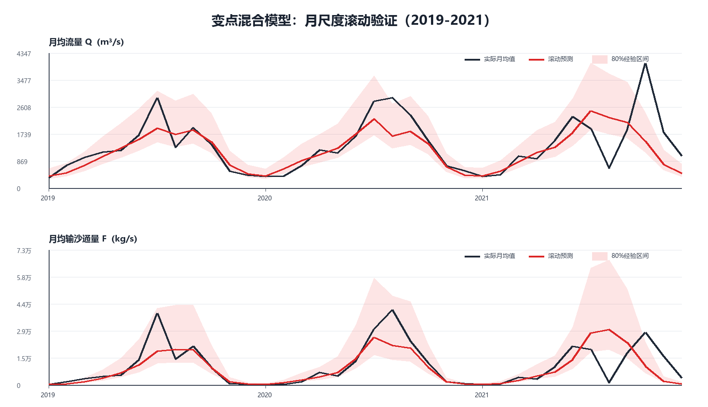
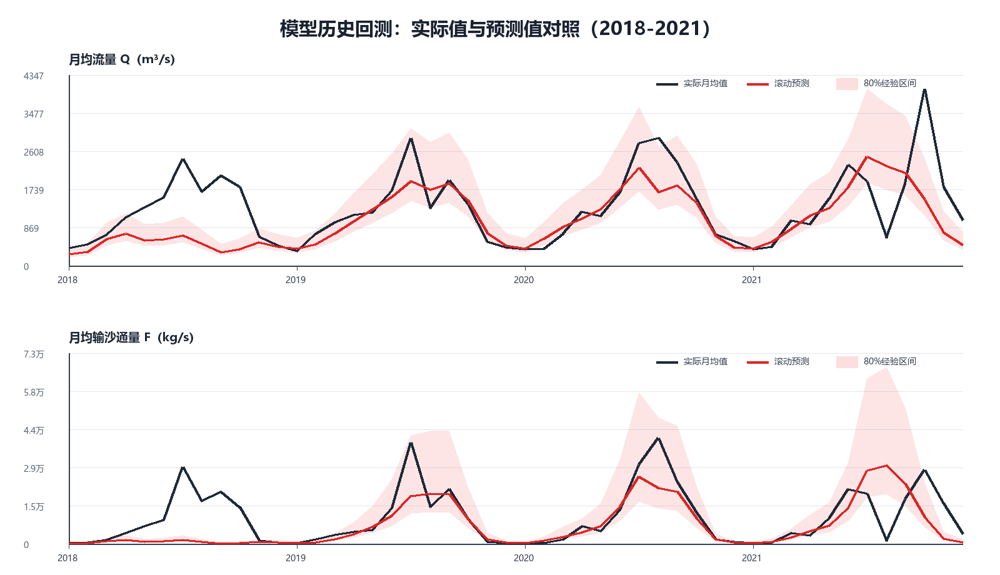
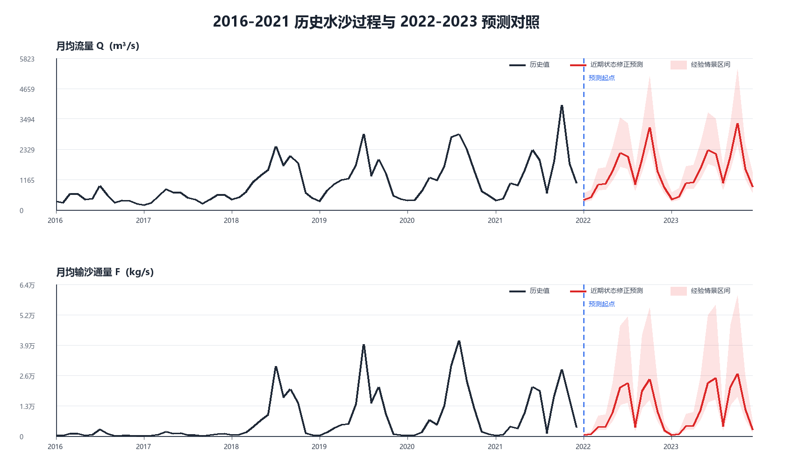

# 问题三：变点感知的月-日两尺度混合预测

## 改进结论

年均水沙序列在 2018 年出现明显状态跃迁，因此不再把 2016-2017 低水沙状态与跃迁后的年份等权拟合。模型以月尺度预测未来趋势，再把月均值分配到日尺度，用于采样计划。

逐日洪峰的准确日期受调度和降雨影响，无法仅凭日期变量提前两年确定。因此正式精度评价采用月尺度滚动外推；逐日结果表示季节风险形状，不解释为精确洪峰预报。

## 模型结构

1. 用年均对数水沙水平识别结构变点。
2. 在变点后数据上拟合带三阶 Fourier 季节项的岭回归。
3. 将 Fourier 月模型与原 STL/季节模板模型组合，权重由 2019-2021 留一年验证选择。
4. 用验证残差的 10% 和 90% 分位数构造经验情景区间。
5. 保留原模型日内季节形状，并逐月缩放到混合模型预测的月均值。
6. 最终外推使用最新状态自适应修正：基准季节形状权重 40%，2021 年型权重 60%；每个预测年的年度均值保持不变。

## 参数

| target                  | regime_start | fourier_weight | legacy_weight | low_factor | high_factor |
| ----------------------- | ------------ | -------------- | ------------- | ---------- | ----------- |
| mean_flow_m3s           | 2018         | 0.55           | 0.45          | 0.7619     | 1.6188      |
| mean_sediment_flux_kg_s | 2018         | 0.7            | 0.3           | 0.63322    | 2.2583      |

## 月尺度滚动验证

| target                  | model                 | heldout_year | rmse_log | mae_log | r2_log  | wape    |
| ----------------------- | --------------------- | ------------ | -------- | ------- | ------- | ------- |
| mean_flow_m3s           | regime_hybrid         | mean         | 0.35947  | 0.27858 | 0.64623 | 0.27483 |
| mean_flow_m3s           | regime_fourier_ridge  | mean         | 0.36733  | 0.28543 | 0.63352 | 0.2842  |
| mean_flow_m3s           | legacy_daily_ensemble | mean         | 0.37516  | 0.287   | 0.62785 | 0.28289 |
| mean_sediment_flux_kg_s | regime_hybrid         | mean         | 0.74557  | 0.55376 | 0.65091 | 0.44608 |
| mean_sediment_flux_kg_s | regime_fourier_ridge  | mean         | 0.75385  | 0.55449 | 0.6434  | 0.44879 |
| mean_sediment_flux_kg_s | legacy_daily_ensemble | mean         | 0.8016   | 0.61138 | 0.62981 | 0.49345 |

相对上一版模型的直接改进为：

| target                  | legacy_rmse_log | hybrid_rmse_log | rmse_reduction_pct | legacy_wape | hybrid_wape |
| ----------------------- | --------------- | --------------- | ------------------ | ----------- | ----------- |
| mean_flow_m3s           | 0.37516         | 0.35947         | 4.1816             | 0.28289     | 0.27483     |
| mean_sediment_flux_kg_s | 0.8016          | 0.74557         | 6.9894             | 0.49345     | 0.44608     |

完整的 2018-2021 严格时间外推对照如下。每一年只使用该年以前的数据；2018 年是结构突变压力测试。

2018 年只用 2016-2017 年数据无法预见制度性跃迁，因此将其视为结构突变压力测试，不与 2019-2021 常规滚动预测平均。这个处理避免用一个先验不可知的突变夸大模型日常外推误差。

## 2022-2023 平水情景预测

| scenario | year | pred_water_volume_1e8_m3 | pred_sediment_mass_1e4_t | pred_mean_flow_m3s | pred_mean_sediment_flux_kg_s | max_pred_flow_m3s | max_pred_sediment_flux_kg_s |
| -------- | ---- | ------------------------ | ------------------------ | ------------------ | ---------------------------- | ----------------- | --------------------------- |
| normal   | 2022 | 449.19                   | 32301                    | 1424.4             | 10243                        | 3828.7            | 39853                       |
| normal   | 2023 | 473.58                   | 35402                    | 1501.7             | 11226                        | 4036.1            | 43705                       |

完整偏枯、平水、偏丰结果见 `results/forecast_annual_flux_2022_2023.csv`。

## 历史与预测连续对照

近期状态修正保留了 2021 年 8 月低谷和 10-11 月秋季高值特征，避免最终预测继续把 8 月机械设置为唯一洪峰。该修正反映最新观测状态，但不作为 2019-2021 交叉验证最优参数；其权重敏感性见 `qa/recent_regime_sensitivity.csv`。

## 论文表述边界

模型能较稳定地给出月度水沙趋势、汛期风险窗口和年度总量；不能保证两年前精确命中某一天的洪峰。采样方案因此采用汛期固定加密与高风险窗口加密，并建议获得新监测值后按月滚动更新。
