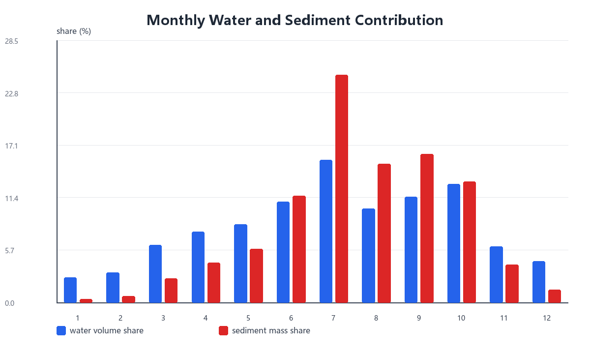
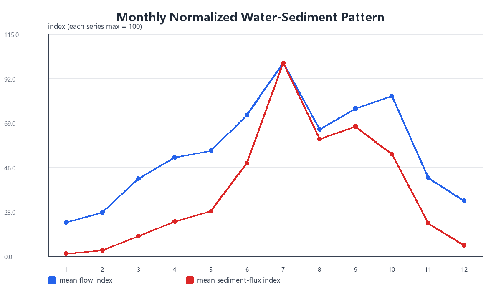
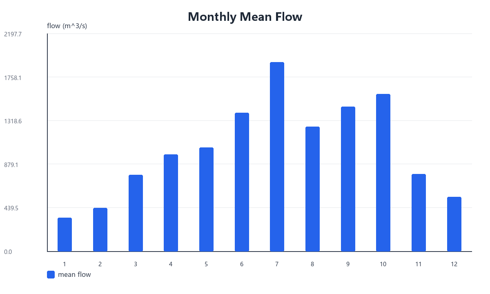
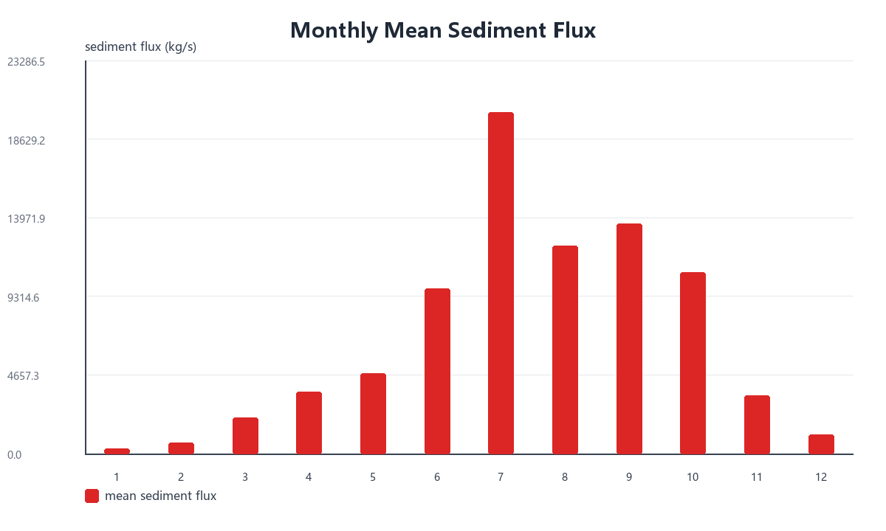

# 问题二 canonical run 分析摘要

本运行以问题一清洗序列为显式上游输入。基准口径是在逐小时时间轴上分别线性插值流量、含沙量和已计算的沙通量，再聚合为日均量；以下判断只描述该处理口径下的数据特征，不作水库调度或调水调沙等因果归因。

上游时刻中模型补全含沙量占比为 87.13%。因此，沙通量及其突变结果同时继承问题一模型误差，不能等同于全部实测结论。

## 年际结果

| year | days | water_volume_1e8_m3 | sediment_mass_1e4_t | mean_flow_m3s | mean_sediment_flux_kg_s | max_daily_flow_m3s | max_daily_sediment_flux_kg_s | water_yoy_change | sediment_yoy_change |
| ---- | ---- | ------------------- | ------------------- | ------------- | ----------------------- | ------------------ | ---------------------------- | ---------------- | ------------------- |
| 2016 | 366  | 143.75              | 2322.9              | 454.6         | 734.56                  | 1483.8             | 8281.9                       | nan              | nan                 |
| 2017 | 365  | 153.35              | 2351.4              | 486.27        | 745.63                  | 943.92             | 2820.5                       | 0.066758         | 0.012296            |
| 2018 | 365  | 388.91              | 27798               | 1233.2        | 8814.6                  | 3639.4             | 74737                        | 1.5361           | 10.822              |
| 2019 | 365  | 387.21              | 30145               | 1227.8        | 9558.8                  | 4158.3             | 67196                        | -0.0043679       | 0.08443             |
| 2020 | 366  | 433.8               | 36032               | 1371.8        | 11394                   | 4711               | 76915                        | 0.12032          | 0.19531             |
| 2021 | 365  | 472.7               | 32734               | 1498.9        | 10380                   | 4964.6             | 67948                        | 0.089675         | -0.091521           |

2018—2021 年的基准口径年度水量和排沙量高于 2016—2017 年；这里的差异是描述性结果，未进行独立的结构突变显著性检验。

## 季节性结果

| month | days | mean_flow_m3s | mean_sediment_kgm3 | mean_sediment_flux_kg_s | water_volume_1e8_m3 | sediment_mass_1e4_t | water_share | sediment_share | sediment_to_water_share_ratio |
| ----- | ---- | ------------- | ------------------ | ----------------------- | ------------------- | ------------------- | ----------- | -------------- | ----------------------------- |
| 1     | 186  | 336.39        | 0.84985            | 304.26                  | 54.059              | 488.96              | 0.027307    | 0.0037217      | 0.13629                       |
| 2     | 170  | 436           | 1.1916             | 642.75                  | 64.04               | 944.08              | 0.032348    | 0.0071857      | 0.22214                       |
| 3     | 186  | 769.24        | 2.4272             | 2129.3                  | 123.62              | 3421.9              | 0.062443    | 0.026045       | 0.4171                        |
| 4     | 180  | 977.54        | 3.3513             | 3661.8                  | 152.03              | 5694.8              | 0.076792    | 0.043345       | 0.56445                       |
| 5     | 186  | 1045.8        | 3.7697             | 4750.9                  | 168.07              | 7634.9              | 0.084896    | 0.058112       | 0.68451                       |
| 6     | 180  | 1397.5        | 4.8844             | 9782.1                  | 217.34              | 15213               | 0.10978     | 0.11579        | 1.0547                        |
| 7     | 186  | 1911          | 7.8454             | 20249                   | 307.11              | 32541               | 0.15513     | 0.24768        | 1.5966                        |
| 8     | 186  | 1257.5        | 5.3357             | 12300                   | 202.09              | 19766               | 0.10208     | 0.15045        | 1.4738                        |
| 9     | 180  | 1459.9        | 5.5883             | 13625                   | 227.04              | 21189               | 0.11469     | 0.16128        | 1.4062                        |
| 10    | 186  | 1585.7        | 4.699              | 10742                   | 254.82              | 17262               | 0.12872     | 0.13139        | 1.0208                        |
| 11    | 180  | 778.49        | 2.6828             | 3466.5                  | 121.07              | 5391.1              | 0.061156    | 0.041033       | 0.67096                       |
| 12    | 186  | 550.26        | 1.574              | 1142.2                  | 88.429              | 1835.5              | 0.044667    | 0.013971       | 0.31277                       |

| period  | days | water_share | sediment_share | mean_flow_m3s | mean_sediment_flux_kg_s |
| ------- | ---- | ----------- | -------------- | ------------- | ----------------------- |
| jun_jul | 366  | 0.26491     | 0.36347        | 1658.5        | 15101                   |
| jun_oct | 918  | 0.61039     | 0.80659        | 1523.5        | 13361                   |
| jul     | 186  | 0.15513     | 0.24768        | 1911          | 20249                   |

绝对流量和绝对沙通量分别绘图，避免在同一纵轴混用 `m^3/s` 与 `kg/s`。逐年汛期占比和峰值月份见 `validation/seasonality_by_year.csv`；总样本月度集中不能自动推出每一年完全相同。

## 突变候选

基准参数为前后各 7 日窗口、得分阈值 3.0、事件最小间隔 20 日、最多 15 个事件。阈值先筛选候选，再按得分去除相邻事件。

| date       | year | month | mean_flow_m3s | mean_sediment_kgm3 | mean_sediment_flux_kg_s | flow_contrast_z | sediment_contrast_z | abrupt_score | main_direction |
| ---------- | ---- | ----- | ------------- | ------------------ | ----------------------- | --------------- | ------------------- | ------------ | -------------- |
| 2016-06-21 | 2016 | 6     | 607.92        | 1.6606             | 1024.2                  | 3.4649          | 3.4034              | 3.4649       | flow_rise      |
| 2018-07-28 | 2018 | 7     | 1591.9        | 8.2132             | 13136                   | -3.2878         | -3.291              | 3.291        | sediment_fall  |
| 2019-06-24 | 2019 | 6     | 2576.2        | 13.301             | 34373                   | 3.4518          | 3.2074              | 3.4518       | flow_rise      |
| 2019-08-14 | 2019 | 8     | 825.25        | 3.0148             | 2519                    | -5.6017         | -5.6098             | 5.6098       | sediment_fall  |
| 2019-09-16 | 2019 | 9     | 2460.2        | 14.907             | 36876                   | 3.7236          | 3.5955              | 3.7236       | flow_rise      |
| 2019-10-23 | 2019 | 10    | 956.65        | 3.3084             | 3209                    | -2.6706         | -3.0498             | 3.0498       | sediment_fall  |
| 2021-07-10 | 2021 | 7     | 988.38        | 3.501              | 3580.6                  | -4.3049         | -4.4888             | 4.4888       | sediment_fall  |
| 2021-07-30 | 2021 | 7     | 1014.8        | 3.3468             | 3402.7                  | -3.0294         | -3.5184             | 3.5184       | sediment_fall  |
| 2021-08-31 | 2021 | 8     | 755.58        | 2.1359             | 1635.1                  | 3.2964          | 3.886               | 3.886        | sediment_rise  |
| 2021-09-20 | 2021 | 9     | 1782.5        | 8.3361             | 15148                   | 5.0837          | 5.442               | 5.442        | sediment_rise  |
| 2021-10-24 | 2021 | 10    | 2416.7        | 9.969              | 24162                   | -3.0271         | -1.4815             | 3.0271       | flow_fall      |

27 组窗口/阈值/间隔组合对基准事件的 7 日邻域覆盖率中位数为 63.6%。这说明事件日期会随参数变化；正文应优先引用 `abrupt_event_stability.csv` 中匹配率较高的事件，并将其称为算法识别的候选突变，而非已知原因事件。

## 周期性结果

| series        | period_days | period_months | relative_power |
| ------------- | ----------- | ------------- | -------------- |
| water_flux    | 365.33      | 12.003        | 0.33978        |
| water_flux    | 438.4       | 14.403        | 0.19202        |
| water_flux    | 313.14      | 10.288        | 0.071411       |
| water_flux    | 730.67      | 24.005        | 0.041145       |
| water_flux    | 243.56      | 8.0018        | 0.025595       |
| sediment_flux | 365.33      | 12.003        | 0.34269        |
| sediment_flux | 438.4       | 14.403        | 0.19779        |
| sediment_flux | 313.14      | 10.288        | 0.078992       |
| sediment_flux | 730.67      | 24.005        | 0.042382       |
| sediment_flux | 243.56      | 8.0018        | 0.024146       |

| series        | lag_days | autocorrelation |
| ------------- | -------- | --------------- |
| water_flux    | 30       | 0.64686         |
| water_flux    | 90       | 0.3044          |
| water_flux    | 180      | -0.071892       |
| water_flux    | 365      | 0.55219         |
| sediment_flux | 30       | 0.66763         |
| sediment_flux | 90       | 0.30873         |
| sediment_flux | 180      | -0.067045       |
| sediment_flux | 365      | 0.54749         |

不同插值口径及前后五年子区间的频谱检查中，主峰落在 300—450 日年尺度带的比例为 100.0%。由于完整样本只有 6 年，结论应表述为“存在较强年尺度周期证据”，不宜表述为已证明长期稳定周期；次级频谱峰也不作确定性物理解释。

## 稳健性边界

| method                    | water_total_1e8_m3 | sediment_total_1e4_t | water_total_relative_difference | sediment_total_relative_difference | max_monthly_water_share_difference_pp | max_monthly_sediment_share_difference_pp | jun_oct_water_share | jun_oct_sediment_share | peak_water_month | peak_sediment_month |
| ------------------------- | ------------------ | -------------------- | ------------------------------- | ---------------------------------- | ------------------------------------- | ---------------------------------------- | ------------------- | ---------------------- | ---------------- | ------------------- |
| linear_flux_direct        | 1979.7             | 1.3138e+05           | 0                               | 0                                  | 0                                     | 0                                        | 0.61039             | 0.80659                | 7                | 7                   |
| linear_components_product | 1979.7             | 1.3137e+05           | 0                               | -7.354e-05                         | 0                                     | 0.0010045                                | 0.61039             | 0.80662                | 7                | 7                   |
| previous_flux_direct      | 1980.1             | 1.3143e+05           | 0.00017689                      | 0.00037215                         | 0.0072005                             | 0.0090517                                | 0.6104              | 0.80661                | 7                | 7                   |

三个插值口径相对基准的六年总排沙量最大绝对差异为 0.04%。插值稳健性只检验本题从不等间隔序列到小时/日尺度的处理选择，不包含问题一含沙量模型的不确定性传播。

逐年季节性：

| year | jun_oct_water_share | jun_oct_sediment_share | peak_water_month | peak_sediment_month |
| ---- | ------------------- | ---------------------- | ---------------- | ------------------- |
| 2016 | 0.4797              | 0.59874                | 7                | 7                   |
| 2017 | 0.37677             | 0.31602                | 4                | 4                   |
| 2018 | 0.65078             | 0.85121                | 7                | 7                   |
| 2019 | 0.63442             | 0.85307                | 7                | 7                   |
| 2020 | 0.68737             | 0.87657                | 8                | 8                   |
| 2021 | 0.60236             | 0.69885                | 10               | 10                  |

## 可用于后续写作的保守结论

1. 在基准插值口径下，六年水量和排沙量具有明显的月份集中现象，6—10 月占比较高。
2. 7 日窗口算法在汛期附近识别出若干高分突变候选，但日期和数量受窗口、阈值、事件间隔影响。
3. 完整序列与两段五年子样本均应结合 `periodicity_robustness.csv` 解读；六年数据支持年尺度成分，不足以证明长期稳定性。
4. 沙通量结论依赖问题一大量模型补全值，应与输入覆盖率和插值敏感性结果同时报告。
