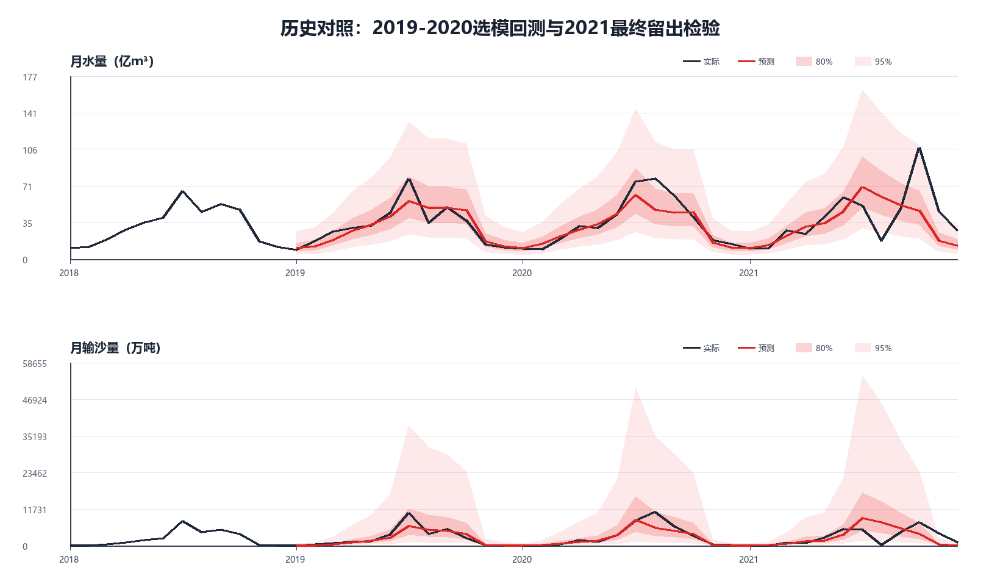
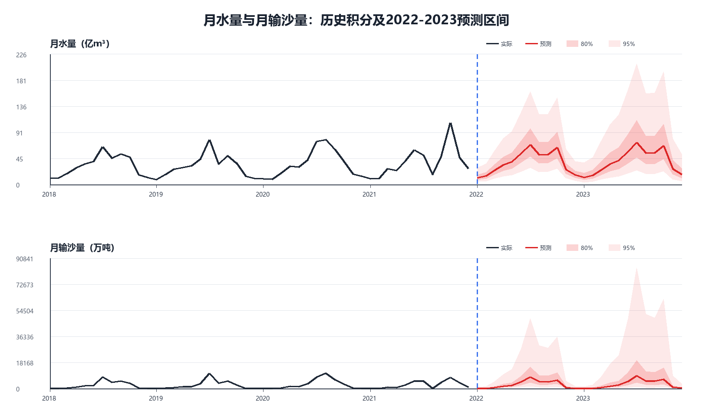
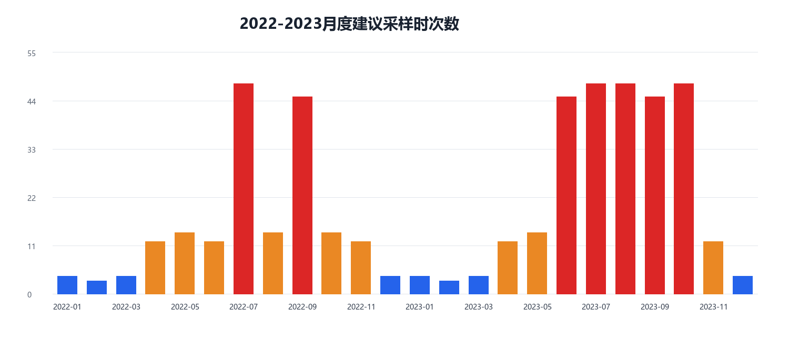

# 问题三完整解题思路：月尺度水沙总量预测与采样方案

## 0. 文档归属

- 训练包：`training-05-yellow-river`
- 对应问题：问题三（q3）
- 候选路线：`r01-monthly-flux-forecast`
- 当前依据运行：`run-20260809-1538-2021-holdout`
- 代码入口：`../code/monthly_flux_forecast.py`
- 主要目标：预测2022-2023年月水量、月输沙量及年度总量，给出月度预测区间，并据月度风险制定采样日期和时段。

## 1. 问题理解与总体思路

问题三既要求预测未来两年的水沙变化，又要求据此安排监测采样。原始观测是不等时间间隔的瞬时水沙数据，而未来两年不存在能够支撑逐日确定性预测的降雨、上游来水和水库调度信息。因此，本路线将“预测”和“采样”分成两个尺度：

1. 预测尺度采用月尺度。先从原始时间序列直接积分得到月水量和月输沙量，再预测2022-2023年24个月的总量。
2. 不确定性通过80%和95%月度预测区间表达，不把未知的未来异常过程包装成确定值。
3. 日尺度不预测水沙通量，只根据月度风险确定采样日期与时段。
4. 2016-2017与2018-2021存在显著水平差异。前两年用于识别结构突变，不进入未来高通量状态的预测模型。
5. 模型选择和最终检验分离：2019-2020扩展窗口回测用于选模，2021完整留出用于最终检验。

整体流程为：

```text
原始不等间隔观测
  -> 月界切分与梯形积分
  -> 2016-2021共72个月总量
  -> 识别2018年结构跃迁
  -> 取2018-2021共48个月作为有效建模期
  -> 2019-2020时间回测比较候选模型
  -> 2021整年独立留出检验
  -> 2018-2021重新训练最终模型
  -> 预测2022-2023月总量及区间
  -> 汇总年度总量
  -> 根据月输沙风险安排日尺度采样
```

## 2. 数据来源与变量口径

### 2.1 主要输入

主要训练数据来自问题一清洗后的不等间隔观测：

`process/q1/routes/r01-log-linear-sediment/runs/run-20260809-0000-imported-legacy/results/data/processed/cleaned_hydro_timeseries.csv`

使用字段为：

| 字段 | 含义 | 单位 |
| --- | --- | --- |
| `datetime` | 观测时间 | 时间戳 |
| `flow_m3s` | 瞬时流量 | m3/s |
| `sediment_flux_kg_s` | 瞬时输沙通量 | kg/s |

2016-2021年共有16,735条有效观测，典型时间间隔约4小时，最大间隔12小时，数据密度足以进行分月数值积分。

### 2.2 问题二数据的使用边界

问题二生成的逐日序列不作为问题三的训练样本，只承担两个辅助作用：

1. 将直接月积分结果与问题二逐日汇总结果比较，检查量纲和数值一致性。
2. 从问题二历史突变事件中统计高风险月份，作为采样风险的一小部分依据。

这样避免把时间插值得到的逐日或逐小时数值误当作新增独立信息。

## 3. 月水量与月输沙量的直接积分

设相邻观测时刻为 `t_i` 和 `t_{i+1}`，流量为 `Q_i`、`Q_{i+1}`，瞬时输沙通量为 `F_i`、`F_{i+1}`。在相邻时刻之间采用梯形积分：

\[
\Delta W_i=\frac{Q_i+Q_{i+1}}{2}(t_{i+1}-t_i),
\]

\[
\Delta S_i=\frac{F_i+F_{i+1}}{2}(t_{i+1}-t_i).
\]

若一个观测区间跨越月界，则先按相邻观测间线性变化在月界处求值，再把区间切分到相邻月份。每月累加后得到：

\[
W_m=\sum_{i\in m}\Delta W_i,\qquad
S_m=\sum_{i\in m}\Delta S_i.
\]

输出单位转换为：

\[
Y^{(W)}_m=\frac{W_m}{10^8}\quad(\text{亿m3}),
\]

\[
Y^{(S)}_m=\frac{S_m}{10^7}\quad(\text{万吨}).
\]

线性假设只用于积分和月界切分，不生成额外训练样本。最终得到2016年1月至2021年12月连续72个月。

直接积分与问题二逐日汇总的差异如下：

| 目标 | 中位绝对相对差异 | 95%分位差异 | 最大差异 |
| --- | ---: | ---: | ---: |
| 月水量 | 0.0310% | 0.0967% | 0.1532% |
| 月输沙量 | 0.0596% | 0.1697% | 0.3647% |

最大差异不足0.4%，说明两种积分口径基本一致，也说明此前2021年预测失配并非由问题二的时间插值直接造成。

## 4. 结构突变识别与有效建模期

六年年度积分结果为：

| 年份 | 年水量（亿m3） | 年输沙量（万吨） |
| ---: | ---: | ---: |
| 2016 | 143.75 | 2322.83 |
| 2017 | 153.35 | 2351.45 |
| 2018 | 388.91 | 27797.68 |
| 2019 | 387.21 | 30144.71 |
| 2020 | 433.80 | 36032.00 |
| 2021 | 472.71 | 32734.97 |

2018年相对于2016-2017均值：

- 年水量上升至2.62倍；
- 年输沙量上升至11.89倍；
- 2019-2021继续维持高位，而不是立即回到旧水平。

因此，2018年更适合解释为持续性状态跃迁，而不是一个可删除的孤立异常值。2016-2017属于突变前低通量状态，只用于说明变化背景；预测2022-2023时，统一使用2018-2021的48个月高通量状态数据。

## 5. 建模假设

1. 2018年后的水沙过程处于同一大尺度状态，2018-2021的季节规律对2022-2023仍有参考意义。
2. 月尺度趋势和年周期可以从有限历史中估计，但未来单次暴雨、调度或异常低谷不可精确预知。
3. 水量和输沙量均为非负且右偏，误差更接近倍数误差，因此在 `log(1+y)` 尺度建模。
4. 在缺少未来外生变量时，模型只预测条件于历史月序列的基准情景；极端风险由预测区间和采样加密承担。
5. 2023年预测距离训练期更远，其区间应宽于2022年。

## 6. 候选模型设计

水量和输沙量分别训练、分别比较。候选模型从“简单季节基线”到“趋势周期回归”和“自回归”逐级增加复杂度，以检验复杂模型是否真的带来稳定改进。

### 6.1 季节朴素模型

以训练集最近一年相同月份为基准，并乘以受限年度趋势：

\[
\widehat Y_{y,m}=Y_{y_0,m}\exp[g(y-y_0)].
\]

年度趋势 `g` 根据最近四个年度总量的 `log(1+annual total)` 斜率估计。为避免短序列趋势爆炸，水量斜率限制在 `[-0.08,0.08]`，输沙量限制在 `[-0.12,0.12]`。

选择该模型的目的，是提供一个容易解释且难以过拟合的季节基线。复杂模型只有显著优于它才值得采用。

### 6.2 状态气候模型

对2018年后的同月观测在对数尺度进行近期加权：

\[
L_m=\exp\left(
\frac{\sum_y w_y\log(1+Y_{y,m})}{\sum_yw_y}
\right)-1,
\]

\[
w_y=\exp[-0.55(y_{\max}-y)].
\]

未来预测为：

\[
\widehat Y_{y,m}=L_m\exp[g(y-y_{\max})].
\]

该模型强调2018年后的新状态，并通过指数衰减赋予近期年份更高权重，适合样本少、结构突变明显的情形。

### 6.3 Fourier岭回归

对目标作对数变换：

\[
z_t=\log(1+Y_t).
\]

回归特征包括：

- 连续时间趋势；
- 2018年后趋势项；
- 1、2、3阶年周期正弦和余弦项；
- 6-10月汛期指标；
- 7-10月峰值窗口指标。

模型可写为：

\[
z_t=\beta_0+\beta_1T_t+\beta_2T^{post}_t
+\sum_{k=1}^{3}\left[
a_k\sin\left(\frac{2\pi km_t}{12}\right)
+b_k\cos\left(\frac{2\pi km_t}{12}\right)
\right]
+\gamma_1I_{6\le m\le10}
+\gamma_2I_{7\le m\le10}+\varepsilon_t.
\]

参数通过岭回归求解：

\[
\widehat\beta=arg\min_\beta
\left\{\lVert z-X\beta\rVert_2^2+\alpha\lVert\beta_{-0}\rVert_2^2\right\},
\]

其中截距不惩罚，其他特征先标准化。候选惩罚参数为：

`alpha = 0.01, 0.03, 0.1, 0.3, 1, 3, 10`。

该模型的优势是能够用少量参数平滑表达月度季节峰谷，同时岭惩罚可缓解48个月小样本下的共线性和过拟合。

### 6.4 季节滞后岭回归

该模型在Fourier日历特征基础上增加：

- 1、2、3、6、12月滞后；
- 最近3个月和12个月移动平均。

预测未来多个月时采用递归方式：下一月需要的滞后值由前一月预测值补入。候选参数为：

`alpha = 0.1, 0.3, 1, 3, 10, 30`。

该模型用于检验短期记忆是否能优于稳定季节模式。但它需要至少一个完整年周期构造滞后特征；在2019冷启动回测中训练数据只有2018年，信息量明显不足，因此复杂滞后模型存在天然劣势。

## 7. 两阶段时间验证与模型选择

### 7.1 为什么不随机划分月份

若把72个月随机划分为训练集和测试集，训练集中可能出现测试月份之后的数据，且相邻月份会同时落入两侧，造成时间信息泄漏。问题三的实际任务是用过去预测未来，因此采用扩展窗口时间回测：

| 阶段 | 训练区间 | 测试区间 | 用途 |
| --- | --- | --- | --- |
| 选模回测1 | 2018 | 2019 | 候选模型评分 |
| 选模回测2 | 2018-2019 | 2020 | 候选模型评分 |
| 最终留出检验 | 2018-2020 | 2021 | 独立评价，不再选模 |
| 最终训练 | 2018-2021 | 2022-2023 | 未来预测 |

2019和2020的评分取算术平均。模型先在这两年中确定，随后固定模型，在完全未参与选模的2021年上检验。

### 7.2 评价指标

主要选择指标为对数RMSE：

\[
RMSE_{log}=\sqrt{\frac1n\sum_{i=1}^{n}
[\log(1+y_i)-\log(1+\widehat y_i)]^2}.
\]

辅助指标包括：

\[
MAE_{log}=\frac1n\sum_i
|\log(1+y_i)-\log(1+\widehat y_i)|,
\]

\[
R^2_{log}=1-
\frac{\sum_i(z_i-\widehat z_i)^2}
{\sum_i(z_i-\bar z)^2},
\]

\[
WAPE=\frac{\sum_i|y_i-\widehat y_i|}{\sum_i|y_i|}.
\]

以对数RMSE为主，是因为水沙峰谷相差较大，原尺度平方误差容易完全被少数汛期峰值支配；对数误差更重视倍数偏差，也会明显惩罚“把谷预测成峰”。

### 7.3 候选模型数据对比

各模型家族在2019-2020选模回测中的最佳结果如下：

| 目标 | 候选模型 | 最佳参数 | 平均对数RMSE | 平均对数R2 | 平均WAPE |
| --- | --- | ---: | ---: | ---: | ---: |
| 水量 | Fourier岭回归 | 1 | **0.22499** | **0.87069** | 19.30% |
| 水量 | 状态气候模型 | - | 0.23272 | 0.86321 | **17.03%** |
| 水量 | 季节朴素模型 | - | 0.26025 | 0.82740 | 18.62% |
| 水量 | 季节滞后岭 | 3 | 0.29354 | 0.78158 | 21.21% |
| 输沙量 | Fourier岭回归 | 1 | **0.43564** | **0.91828** | 28.41% |
| 输沙量 | 状态气候模型 | - | 0.46781 | 0.90627 | **26.86%** |
| 输沙量 | 季节朴素模型 | - | 0.52807 | 0.87911 | 30.13% |
| 输沙量 | 季节滞后岭 | 3 | 0.66549 | 0.80191 | 44.29% |

状态气候模型的WAPE略低，但预先规定的主要指标是对数RMSE，不能看到结果后临时更换标准。Fourier岭回归在水量和输沙量上都取得最低对数RMSE和最高对数R2，因此两个目标统一选择该模型。

Fourier岭惩罚参数的敏感性结果为：

| alpha | 水量对数RMSE | 输沙量对数RMSE |
| ---: | ---: | ---: |
| 0.01 | 0.22985 | 0.45350 |
| 0.03 | 0.22978 | 0.45300 |
| 0.10 | 0.22939 | 0.45110 |
| 0.30 | 0.22782 | 0.44548 |
| 1.00 | **0.22499** | **0.43564** |
| 3.00 | 0.23558 | 0.46035 |
| 10.00 | 0.28457 | 0.59528 |

误差随惩罚强度呈先降后升趋势：惩罚过小会保留小样本噪声，惩罚过大会把季节峰谷过度压平，`alpha=1`在两类目标上同时达到最优，因而不是只针对某一变量偶然选择。

## 8. 2021年最终留出检验

固定 `fourier_ridge_alpha_1` 后，用2018-2020训练并一次性预测2021年12个月：

| 目标 | 对数RMSE | 对数MAE | 对数R2 | WAPE |
| --- | ---: | ---: | ---: | ---: |
| 月水量 | 0.56272 | 0.43200 | 0.25529 | 43.22% |
| 月输沙量 | 1.29866 | 0.91807 | 0.14529 | 73.62% |

2021年明显弱于2019-2020，主要由季节错位造成：

- 2021年8月实际水量为17.15亿m3，预测为60.20亿m3；
- 2021年8月实际输沙量为296.60万吨，预测为7509.15万吨；
- 2021年10月实际水量达到107.75亿m3，而模型预测47.06亿m3；
- 2021年10-11月的高值较历史常规汛期明显延后。

仅使用历史月水沙序列时，模型无法在2020年底提前知道2021年的水库调度、降雨和上游来水状态。因此，本路线不通过删除异常月份、使用2021月内真实滞后值或样本内拟合来粉饰检验结果，而是用预测区间和采样加密表达风险。

## 9. 最终模型训练与2022-2023预测

模型确定后，将2018-2021共48个月全部用于重新训练。水量和输沙量分别训练一套 `fourier_ridge_alpha_1`，预测2022年1月至2023年12月共24个月。

月度点预测如下，水量单位为亿m3，输沙量单位为万吨：

| 月份 | 2022水量 | 2022输沙量 | 2023水量 | 2023输沙量 |
| ---: | ---: | ---: | ---: | ---: |
| 1 | 11.93 | 140.34 | 12.63 | 155.10 |
| 2 | 15.10 | 250.78 | 15.97 | 277.08 |
| 3 | 24.25 | 765.85 | 25.62 | 845.98 |
| 4 | 33.97 | 1612.79 | 35.87 | 1781.40 |
| 5 | 39.42 | 2195.45 | 41.61 | 2424.93 |
| 6 | 53.71 | 4561.94 | 56.67 | 5038.67 |
| 7 | 68.89 | 7978.89 | 72.67 | 8812.63 |
| 8 | 51.89 | 4933.34 | 54.75 | 5448.87 |
| 9 | 52.36 | 4671.46 | 55.25 | 5159.64 |
| 10 | 64.29 | 5909.49 | 67.83 | 6527.02 |
| 11 | 25.85 | 853.38 | 27.30 | 942.65 |
| 12 | 16.75 | 290.39 | 17.71 | 320.83 |

预测保留了稳定季节结构：1-2月处于低值，3-6月逐步上升，7月形成主峰，8-10月维持高位，11-12月回落。

## 10. 80%和95%预测区间

### 10.1 区间构造

收集2019-2021共36个月的真实外推对数残差：

\[
e_i=\log(1+y_i)-\log(1+\widehat y_i).
\]

令 `r_0.80` 和 `r_0.95` 分别为 `|e_i|` 的80%和95%线性经验分位数。若点预测为 `y_hat`，区间为：

\[
L_c=\max\{0,\exp[\log(1+\widehat y)-r_c]-1\},
\]

\[
U_c=\exp[\log(1+\widehat y)+r_c]-1,
\]

其中 `c` 为0.80或0.95。对数尺度区间天然反映倍数误差，反变换后保持非负且通常不对称。

2023年的预测步长更长，将区间半径乘以1.25：

\[
r_{c,2023}=1.25r_c.
\]

### 10.2 历史覆盖效果

| 目标 | 名义覆盖率 | 历史覆盖率 | 对数半径 | 校准月份数 |
| --- | ---: | ---: | ---: | ---: |
| 水量 | 80% | 77.78% | 0.33919 | 36 |
| 水量 | 95% | 94.44% | 0.83986 | 36 |
| 输沙量 | 80% | 77.78% | 0.63581 | 36 |
| 输沙量 | 95% | 94.44% | 1.80469 | 36 |

36个月中，80%区间覆盖28个月，95%区间覆盖34个月，与名义水平接近。输沙半径远大于水量，说明输沙过程的倍数波动和异常风险更强。

80%区间适合作为常规规划范围，95%区间适合作为保守风险边界。95%区间不表示“模型准确率为95%”，而表示在类似重复预测中希望覆盖约95%的真实结果。

## 11. 年度预测结果

年度点预测由12个月点预测求和，年度上下界由对应月度上下界分别求和：

| 年份 | 年水量点预测 | 水量80%区间 | 水量95%区间 |
| ---: | ---: | ---: | ---: |
| 2022 | 458.39 | 323.08-648.33 | 191.10-1077.43 |
| 2023 | 483.88 | 312.52-745.72 | 161.56-1404.80 |

| 年份 | 年输沙量点预测 | 输沙80%区间 | 输沙95%区间 |
| ---: | ---: | ---: | ---: |
| 2022 | 34164.10 | 18084-64531 | 5610.9-207712.7 |
| 2023 | 37734.81 | 17038-83556 | 3943.2-360224.2 |

年度区间是月度边界的汇总，用于风险范围展示，并非单独进行联合覆盖校准的年度置信区间。输沙量95%区间很宽，不是数值错误，而是2021异常残差在有限样本下对风险边界的真实影响。

## 12. 月度风险与采样方案

### 12.1 风险评分

采样重点不是精确追踪未知的未来逐日通量，而是在高通量、高不确定性和历史突变月份提高监测密度。月度风险分数定义为：

\[
R_m=0.45R^{upper}_m
+0.20R^{width}_m
+0.20I^{flood}_m
+0.10I^{peak}_m
+0.05R^{abrupt}_m.
\]

各项含义为：

- `R_upper`：月输沙量95%上界经 `log(1+x)` 后归一化；
- `R_width`：95%区间相对宽度归一化；
- `I_flood`：6-10月汛期指标；
- `I_peak`：7-10月峰值窗口指标；
- `R_abrupt`：问题二历史突变事件的月份频率。

权重把主要注意力放在“可能出现的高输沙上界”上，同时兼顾区间宽度和水文季节。24个月风险分数的前30%划为高风险；其余4-11月划为中风险，其他月份为低风险。

### 12.2 采样频率

| 风险等级 | 日期频率 | 日内时段 | 目的 |
| --- | --- | --- | --- |
| 高风险 | 每2天一次 | 08:00、14:00、20:00 | 跟踪汛期和日内涨落 |
| 中风险 | 每5天一次 | 08:00、20:00 | 覆盖过渡期早晚差异 |
| 低风险 | 每10天一次 | 09:00 | 常规背景监测 |

2022年高风险月份为7月、9月；2023年高风险月份为6-10月。2022年共186个采样时次，2023年共287个，两年合计473个。

日尺度输出仅包含采样日期、采样时刻、风险等级、月风险分数和理由，不包含未来逐日水量或输沙量预测。

## 13. 可视化与图形解读

### 13.1 历史回测与2021留出检验



图中黑线为真实月总量，红线为不使用当年信息的预测值，深红和浅红分别为80%和95%区间。2019-2020的季节趋势和峰值位置拟合较好；2021年8月低谷和10月延迟峰值偏离历史季节规律，因此点预测失配、区间明显扩宽。

### 13.2 2022-2023月度预测区间



蓝色虚线区分历史期与预测期。红线给出未来月度中心预测，深浅阴影表示80%和95%风险范围。2023区间比2022更宽，体现预测距离增加带来的不确定性。

### 13.3 月度采样强度



蓝、橙、红柱分别对应低、中、高风险。采样资源集中在汛期和输沙上界较高月份，避免全年平均分配导致关键时期监测不足。

## 14. 数值与流程质量检查

当前运行设置了9项机器检查，全部通过：

1. 原始月积分序列正好72个月；
2. 突变后有效建模序列正好48个月；
3. 2016年1月至2021年12月月份连续；
4. 历史和未来点预测均为正；
5. 区间满足 `lower95 <= lower80 <= point <= upper80 <= upper95`；
6. 每个2023月份的对数区间都宽于对应2022月份；
7. 年度点预测严格等于12个月点预测之和；
8. 日尺度采样表没有逐日水沙通量字段；
9. 直接积分与问题二汇总的最大差异不超过1%。

## 15. 方法优势

1. 数据口径清楚：预测对象是直接积分的月总量，不把插值数据当作独立样本。
2. 显式处理结构突变：避免2016-2017低通量状态拉低未来预测水平。
3. 时间验证无未来信息泄漏：2019-2020选模，2021独立检验。
4. 候选模型有简单基线和复杂模型，选择有统一指标和参数敏感性支撑。
5. 点预测与不确定性并列报告，不宣称能够精确预测未来异常月份。
6. 预测与采样分工明确：月尺度负责趋势，日尺度负责监测执行。

## 16. 局限性与论文表述边界

1. 突变后只有4个完整年周期，样本仍然有限。
2. 2019回测只有2018一个完整训练年，复杂滞后模型处于冷启动状态。
3. 模型没有未来降雨、上游来水、水库调度和工程运行等外生变量，无法提前识别2021年8月式异常低谷。
4. 2023区间的1.25扩宽系数是基于预测步长的经验处理，应在论文中明确说明。
5. 年度区间由月度边界汇总，并非年度联合分布的严格置信区间。
6. 预测区间根据36个月历史外推残差校准，极端事件样本仍少，不能解释为绝对概率保证。

论文中应区分“历史拟合”和“真实提前预测”。本路线图中的2019-2021红线均为不使用测试年真实值的外推结果，不应为了追求视觉贴合而改成样本内拟合。

## 17. 最终结论

问题三最终采用“直接月积分 + 结构突变分段 + Fourier岭回归 + 两阶段时间验证 + 经验预测区间 + 风险驱动采样”的方案。2019-2020选模回测表明，`alpha=1`的Fourier岭模型能够以较少参数稳定描述突变后水沙序列的趋势和季节周期；2021独立留出检验揭示了无外生变量时对异常调度和季节错位的预测边界。最终预测给出2022年水量458.39亿m3、输沙量34164.10万吨，2023年水量483.88亿m3、输沙量37734.81万吨，并通过80%和95%区间及473个风险分级采样时次表达未来不确定性。
