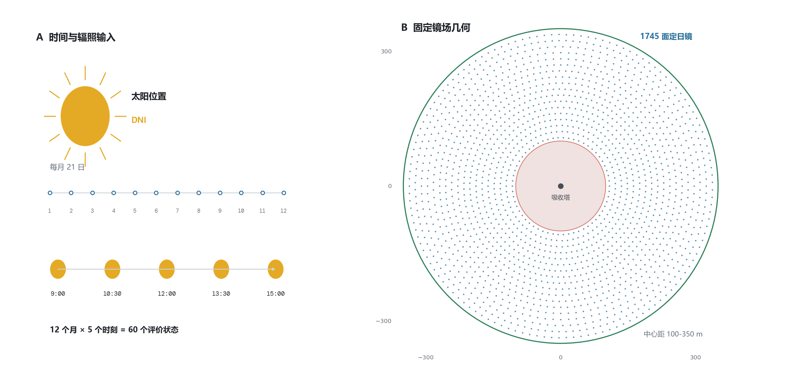
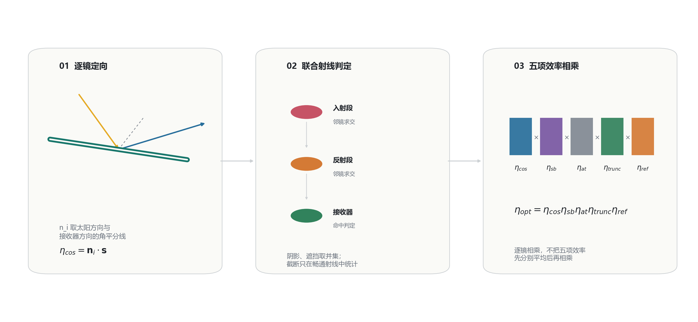
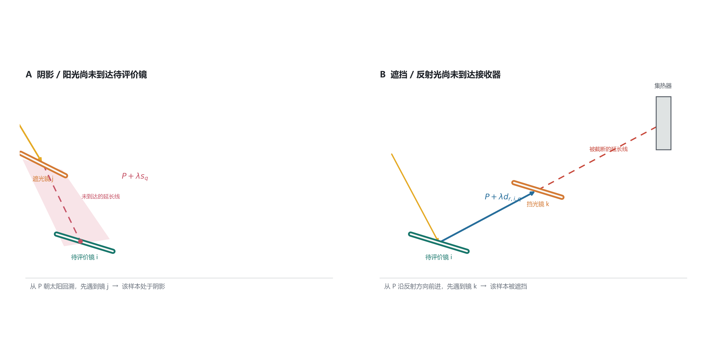
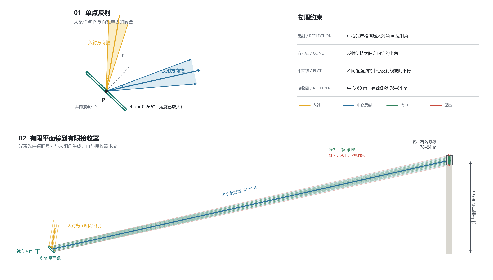
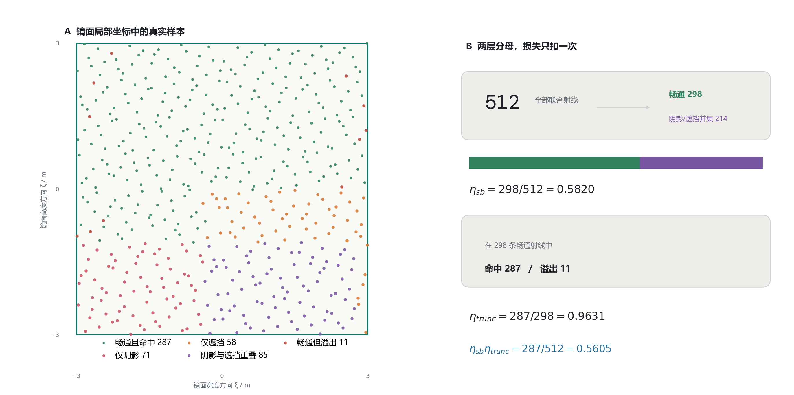
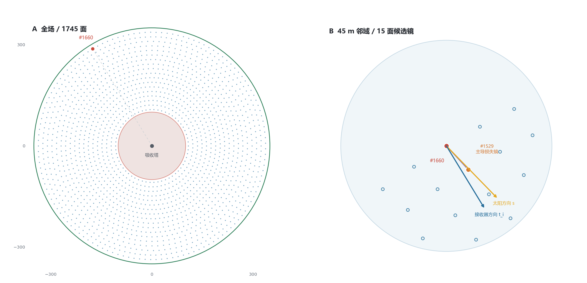
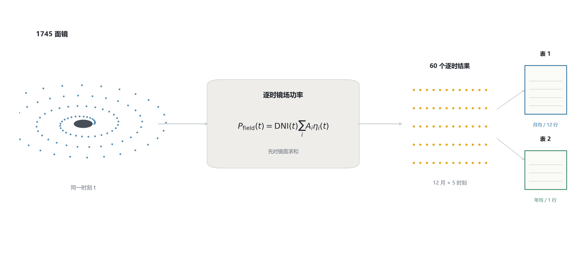
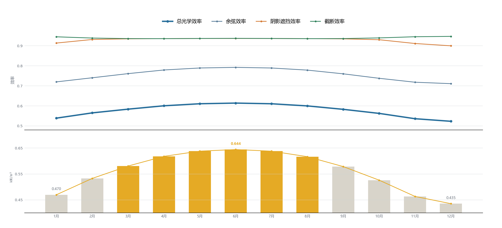

# 问题一完整解题方案

## 1. 问题目标

问题一给定吸收塔位置、定日镜尺寸、安装高度和全部定日镜中心坐标，需要计算：

1. 每月 21 日的平均光学效率、平均余弦效率、平均阴影遮挡效率和平均截断效率；
2. 每月 21 日的单位镜面面积平均输出热功率；
3. 年平均光学效率、年平均余弦效率、年平均阴影遮挡效率和年平均截断效率；
4. 年平均输出热功率；
5. 单位镜面面积年平均输出热功率。

题目规定，每个“年均”指标只使用每月 21 日的 9:00、10:30、12:00、13:30、15:00，共 60 个代表时刻，并对这些时刻等权平均。

本文给出从题目数据到最终表格的完整模型和计算口径。数值结果必须由后续固定布局评价程序运行得到；在评价器尚未执行前，结果表中不填入未经计算的数值。

## 2. 已知数据与预检查

### 2.1 坐标系

采用题目给定的镜场坐标系：

- 原点为圆形场地中心；
- \(x\) 轴正方向为正东；
- \(y\) 轴正方向为正北；
- \(z\) 轴竖直向上。

### 2.2 固定参数

| 参数 | 符号 | 数值 |
|---|---:|---:|
| 场地纬度 | \(\varphi\) | \(39.4^\circ\) |
| 场地海拔 | \(h_{\mathrm{alt}}\) | \(3\ \mathrm{km}\) |
| 太阳常数 | \(G_0\) | \(1.366\ \mathrm{kW/m^2}\) |
| 定日镜数量 | \(N\) | \(1745\) |
| 单镜尺寸 | \(w\times h_{\mathrm{mir}}\) | \(6\ \mathrm m\times6\ \mathrm m\) |
| 单镜面积 | \(A_i\) | \(36\ \mathrm{m^2}\) |
| 镜面总面积 | \(A_{\mathrm{tot}}\) | \(62820\ \mathrm{m^2}\) |
| 定日镜安装高度 | \(z_H\) | \(4\ \mathrm m\) |
| 集热器中心 | \(\boldsymbol R\) | \((0,0,80)\ \mathrm m\) |
| 集热器半径 | \(r_R\) | \(3.5\ \mathrm m\) |
| 集热器高度 | \(h_R\) | \(8\ \mathrm m\) |
| 镜面反射率 | \(\eta_{\mathrm{ref}}\) | \(0.92\) |

第 \(i\) 面定日镜中心为

$$
\boldsymbol M_i=(x_i,y_i,4).
$$

题目所说的吸收塔高度 80 m 是集热器中心离地高度，因此集热器中心是

$$
\boldsymbol R=(0,0,80),
$$

而不是 \((0,0,84)\)。圆柱侧面的高度范围为

$$
76\le z\le84.
$$

### 2.3 附件数据检查

附件中共有 1745 组有效定日镜中心坐标，与题目给出的镜面数量一致。已完成的基础检查为：

- 单镜面积：\(6\times6=36\ \mathrm{m^2}\)；
- 总镜面面积：\(1745\times36=62820\ \mathrm{m^2}\)；
- 镜面中心到场心的径向距离约为 \(107.882\sim337.133\ \mathrm m\)；
- 最小相邻镜面中心距离约为 \(11.680\ \mathrm m\)，大于题目要求的 \(6+5=11\ \mathrm m\)；
- 以镜面半对角线 \(\sqrt{3^2+3^2}\approx4.243\ \mathrm m\) 作保守估计，最内侧镜面仍在 100 m 禁建区外，最外侧镜面仍在 350 m 场地边界内。

## 3. 模型假设

1. 题目给定当地时间直接用于太阳时角公式，不再额外作经度、时区或真太阳时修正。
2. 定日镜为理想平面镜，同一面镜在同一时刻具有统一法向。
3. 控制系统使太阳中心光线经过镜面中心反射后指向集热器中心。
4. 太阳具有有限角半径，取

   $$
   \theta_\odot=0.266^\circ.
   $$

5. 圆柱形外表受光式集热器按圆柱侧壁建模，不把上、下端面计作有效受光面。
6. 题目没有给出吸收塔塔身直径和外形，因此不额外计算塔身阴影；若后续增加塔身几何，应建立新的模型路线。
7. 阴影遮挡效率和截断效率使用统一的确定性低差异射线采样计算。
8. 60 个题目规定时刻等权，不将年平均功率解释为全年热量积分。

## 4. 评价日期与时刻

令 \(D\) 为从 3 月 21 日起算的天数，并按 365 天循环。每月 21 日可取：

| 月份 | \(D\) |
|---:|---:|
| 1 月 | 306 |
| 2 月 | 337 |
| 3 月 | 0 |
| 4 月 | 31 |
| 5 月 | 61 |
| 6 月 | 92 |
| 7 月 | 122 |
| 8 月 | 153 |
| 9 月 | 184 |
| 10 月 | 214 |
| 11 月 | 245 |
| 12 月 | 275 |

每天使用五个当地时刻

$$
ST\in\{9,\ 10.5,\ 12,\ 13.5,\ 15\}.
$$

因此共有 \(12\times5=60\) 个评价时刻，记为 \(t_{m,j}\)。

问题一采用的评价时点与固定镜场布局如图所示：

## 5. 太阳位置

### 5.1 太阳赤纬角

由题目附录，

$$
\sin\delta
=
\sin\left(\frac{2\pi D}{365}\right)\sin(23.45^\circ).
$$

因为太阳赤纬角位于 \([-23.45^\circ,23.45^\circ]\)，程序可取

$$
\delta
=
\arcsin\left[
\sin\left(\frac{2\pi D}{365}\right)\sin(23.45^\circ)
\right].
$$

### 5.2 太阳时角

$$
\omega=\frac{\pi}{12}(ST-12).
$$

上午 \(\omega<0\)，正午 \(\omega=0\)，下午 \(\omega>0\)。

### 5.3 太阳高度角

$$
\sin\alpha_s
=
\cos\delta\cos\varphi\cos\omega
+\sin\delta\sin\varphi.
$$

于是

$$
\alpha_s=\arcsin(\sin\alpha_s).
$$

只有 \(\alpha_s>0\) 时太阳位于地平面以上。本题给定的 60 个时刻应在计算时逐一检查该条件。

### 5.4 太阳方向向量

定义 \(\boldsymbol s\) 为从定日镜指向太阳圆盘中心的单位向量。为了避免仅由 \(\cos\gamma_s\) 求太阳方位角时产生上午、下午象限歧义，程序推荐直接计算东、北、天三个分量：

$$
s_x=-\cos\delta\sin\omega,
$$

$$
s_y=\cos\varphi\sin\delta
-\sin\varphi\cos\delta\cos\omega,
$$

$$
s_z=\sin\varphi\sin\delta
+\cos\varphi\cos\delta\cos\omega.
$$

因此

$$
\boxed{
\boldsymbol s=(s_x,s_y,s_z)
}
$$

且理论上 \(\|\boldsymbol s\|=1\)。数值计算后仍应归一化，以消除浮点误差。

若需要太阳方位角，则从正北方向顺时针定义

$$
\gamma_s=\operatorname{atan2}(s_x,s_y)\pmod{2\pi}.
$$

此时也有

$$
\boldsymbol s
=
(\cos\alpha_s\sin\gamma_s,\,
\cos\alpha_s\cos\gamma_s,\,
\sin\alpha_s).
$$

太阳并非点光源，而是角直径约为 \(0.53^\circ\) 的圆盘。太阳中心方向 \(\boldsymbol s\) 用于太阳位置、太阳高度角、DNI、镜面跟踪法向和余弦效率的计算；阴影、遮挡和截断的几何射线判断则需要在太阳圆盘内采样。取太阳角半径

$$
\boxed{
\theta_\odot=0.266^\circ
\approx4.64\times10^{-3}\ \mathrm{rad}
}
$$

在垂直于 \(\boldsymbol s\) 的平面内建立单位正交基 \(\boldsymbol e_1,\boldsymbol e_2\)，使

$$
\boldsymbol e_1\cdot\boldsymbol s
=\boldsymbol e_2\cdot\boldsymbol s
=\boldsymbol e_1\cdot\boldsymbol e_2=0.
$$

对 \(u_3,u_4\in[0,1]\)，令

$$
\rho=\theta_\odot\sqrt{u_3},
\qquad
\phi=2\pi u_4,
$$

则太阳圆盘上的采样方向为

$$
\boxed{
\boldsymbol s_q
=
\cos\rho\,\boldsymbol s
+\sin\rho
\left(
\cos\phi\,\boldsymbol e_1
+\sin\phi\,\boldsymbol e_2
\right)
}
$$

其中 \(0\le\rho\le\theta_\odot\)。半径使用 \(\sqrt{u_3}\) 可使方向在太阳圆盘角面积上均匀分布；若直接令 \(\rho=\theta_\odot u_3\)，样本会在圆盘中心过密。太阳圆盘方向 \(\boldsymbol s_q\) 对应的光子入射传播方向为

$$
\boldsymbol i_q=-\boldsymbol s_q.
$$

当 \(\rho=0\) 时，\(\boldsymbol s_q=\boldsymbol s\)，退化为太阳中心光线。后续必须区分“从镜面指向太阳”的方向 \(\boldsymbol s_q\) 与光子实际传播方向 \(-\boldsymbol s_q\)。

## 6. 法向直接辐射辐照度 DNI

题目附录给出

$$
DNI
=
G_0\left[
a+b\exp\left(-\frac{c}{\sin\alpha_s}\right)
\right].
$$

其中海拔 \(h_{\mathrm{alt}}=3\ \mathrm{km}\)，故

$$
a
=
0.4237-0.00821(6-3)^2
=0.34981,
$$

$$
b
=
0.5055+0.00595(6.5-3)^2
=0.5783875,
$$

$$
c
=
0.2711+0.01858(2.5-3)^2
=0.275745.
$$

因此本题可以直接使用

$$
\boxed{
DNI(t)
=
1.366\left[
0.34981
+0.5783875
\exp\left(
-\frac{0.275745}{\sin\alpha_s(t)}
\right)
\right]
}
$$

单位为 \(\mathrm{kW/m^2}\)。

这里的海拔必须使用 km，不能把 3000 m 直接代入经验公式。

## 7. 镜面到集热器的几何关系

### 7.1 距离

第 \(i\) 面定日镜中心到集热器中心的空间距离为

$$
d_{HR,i}
=
\|\boldsymbol R-\boldsymbol M_i\|.
$$

代入

$$
\boldsymbol R=(0,0,80),
\qquad
\boldsymbol M_i=(x_i,y_i,4),
$$

得到

$$
\boxed{
d_{HR,i}
=
\sqrt{x_i^2+y_i^2+76^2}
}
$$

注意竖直距离是 \(80-4=76\ \mathrm m\)。

### 7.2 指向集热器的方向

定义

$$
\boxed{
\boldsymbol t_i
=
\frac{\boldsymbol R-\boldsymbol M_i}
{\|\boldsymbol R-\boldsymbol M_i\|}
}
$$

为从第 \(i\) 面定日镜中心指向集热器中心的单位向量。

## 8. 定日镜法向与反射方向

控制系统要求太阳中心光线经过镜面中心反射后指向集热器中心。使用 \(\boldsymbol s\) 表示从镜面指向太阳，使用 \(\boldsymbol t_i\) 表示从镜面指向集热器，则镜面法向是二者的角平分方向：

$$
\boxed{
\boldsymbol n_i
=
\frac{\boldsymbol s+\boldsymbol t_i}
{\|\boldsymbol s+\boldsymbol t_i\|}
}
$$

太阳圆盘上某一方向记为 \(\boldsymbol s_q\)，其入射传播方向为 \(-\boldsymbol s_q\)。根据镜面反射公式，反射方向为

$$
\boxed{
\boldsymbol d_{r,i,q}
=
-\boldsymbol s_q
-2\left[
(-\boldsymbol s_q)\cdot\boldsymbol n_i
\right]\boldsymbol n_i
}
$$

等价地，

$$
\boldsymbol d_{r,i,q}
=
-\boldsymbol s_q
+2(\boldsymbol s_q\cdot\boldsymbol n_i)\boldsymbol n_i.
$$

当 \(\boldsymbol s_q=\boldsymbol s\) 为太阳中心方向时，

$$
\boldsymbol d_{r,i,q}=\boldsymbol t_i.
$$

镜面法向 \(\boldsymbol n_i\) 始终由太阳中心方向 \(\boldsymbol s\) 确定，不会随圆盘内各个采样方向改变。反射变换保持方向之间的夹角，因此

$$
\boxed{
\angle(
\boldsymbol d_{r,i,q},
\boldsymbol t_i
)
=
\angle(
\boldsymbol s_q,
\boldsymbol s
)
=
\rho
}
$$

因此入射方向锥反射后成为以 \(\boldsymbol t_i\) 为轴、半锥角仍为 \(\theta_\odot\) 的反射方向锥。若只估计太阳角半径带来的额外扩展，镜面到集热器距离为 \(d_{HR,i}\) 时，扩展半径近似为

$$
\boxed{
r_{\odot,i}
\approx
d_{HR,i}\tan\theta_\odot
\approx
0.00464d_{HR,i}
}
$$

问题一中镜面到集热器的空间距离约为 \(132\sim346\ \mathrm m\)，因此仅由太阳角造成的扩展半径约为

$$
0.61\sim1.60\ \mathrm m.
$$

该方向扩展与 \(6\ \mathrm m\times6\ \mathrm m\) 有限镜面的空间范围共同形成集热器附近的光斑。由于定日镜是平面镜，同一面镜上各点对太阳中心光线的反射方向均为 \(\boldsymbol t_i\)，而不是分别指向 \(\boldsymbol R\)；将每个镜面采样点直接连接集热器中心会人为制造聚焦，从而高估截断效率。

## 9. 五项光学效率

第 \(i\) 面镜在时刻 \(t\) 的总光学效率为

$$
\boxed{
\eta_i(t)
=
\eta_{sb,i}(t)
\eta_{\cos,i}(t)
\eta_{at,i}
\eta_{\mathrm{trunc},i}(t)
\eta_{\mathrm{ref}}
}
$$

逐镜光学效率的计算顺序如图所示：

下面逐项说明。

### 9.1 余弦效率

太阳法向直接辐射是针对垂直于太阳光线的面积定义的。当太阳光斜射到镜面时，镜面的有效投影面积减小，形成余弦损失。

余弦效率为

$$
\eta_{\cos,i}
=
\boldsymbol s\cdot\boldsymbol n_i.
$$

代入角平分法向，可得

$$
\boxed{
\eta_{\cos,i}
=
\sqrt{
\frac{1+\boldsymbol s\cdot\boldsymbol t_i}{2}
}
}
$$

其范围应满足

$$
0\le\eta_{\cos,i}\le1.
$$

物理意义是：镜面法向越接近太阳方向，太阳光在镜面上的有效投影面积越大，余弦效率越高。

本文按题目附录的口径，使用太阳圆盘中心方向 \(\boldsymbol s\) 计算解析余弦效率。太阳圆盘内的锥形方向 \(\boldsymbol s_q\) 不再逐条修正这一项，而是进入后续阴影、遮挡和截断的几何射线判断，从而避免把同一种角度效应重复计入。

### 9.2 大气透射率

光线从镜面反射后需要在大气中传播到集热器。传播距离越长，大气吸收和散射造成的损失越大。

题目附录给出

$$
\boxed{
\eta_{at,i}
=
0.99321
-0.0001176d_{HR,i}
+1.97\times10^{-8}d_{HR,i}^2
}
$$

适用条件为 \(d_{HR,i}\le1000\ \mathrm m\)。问题一所有镜面均满足该条件。

大气透射率只由镜面中心到集热器中心的固定距离决定，因此对同一面镜而言，它不随评价时刻变化。

### 9.3 阴影遮挡效率

阴影遮挡包括两类损失：

1. 阴影：太阳光到达待评价镜面之前，被其他定日镜截住；
2. 遮挡：待评价镜面反射出的光在到达集热器之前，被其他定日镜截住。

两类区域可能重叠，因此必须计算并集，不能把两种损失面积直接相加。

阴影和遮挡分别发生在入射段与反射段，对应的物理光路如图所示：

#### 9.3.1 镜面局部坐标

令

$$
\boldsymbol k=(0,0,1).
$$

因为镜面上、下边始终平行于地面，可定义镜面水平方向

$$
\boldsymbol u_i
=
\frac{\boldsymbol k\times\boldsymbol n_i}
{\|\boldsymbol k\times\boldsymbol n_i\|},
$$

以及镜面高度方向

$$
\boldsymbol v_i
=
\boldsymbol n_i\times\boldsymbol u_i.
$$

镜面采样点写为

$$
\boxed{
\boldsymbol P_{i,p}
=
\boldsymbol M_i
+\xi_p\boldsymbol u_i
+\zeta_p\boldsymbol v_i
}
$$

其中

$$
\xi_p,\zeta_p\in[-3,3].
$$

#### 9.3.2 射线与邻镜平面求交

从采样点 \(\boldsymbol P\) 沿单位方向 \(\boldsymbol d\) 发射射线

$$
\boldsymbol X(\lambda)
=
\boldsymbol P+\lambda\boldsymbol d.
$$

第 \(j\) 面镜所在平面满足

$$
\boldsymbol n_j\cdot
(\boldsymbol X-\boldsymbol M_j)=0.
$$

因此交点参数为

$$
\boxed{
\lambda
=
\frac{
\boldsymbol n_j\cdot(\boldsymbol M_j-\boldsymbol P)
}{
\boldsymbol n_j\cdot\boldsymbol d
}
}
$$

当分母绝对值小于数值容差时，射线与镜面近似平行，不判为相交。

交点为

$$
\boldsymbol Q
=
\boldsymbol P+\lambda\boldsymbol d.
$$

交点位于第 \(j\) 面 \(6\ \mathrm m\times6\ \mathrm m\) 镜面内部的条件是

$$
\left|
(\boldsymbol Q-\boldsymbol M_j)\cdot\boldsymbol u_j
\right|\le3,
$$

$$
\left|
(\boldsymbol Q-\boldsymbol M_j)\cdot\boldsymbol v_j
\right|\le3.
$$

#### 9.3.3 阴影判定

沿采样太阳方向反向追踪：

$$
\boxed{
\boldsymbol X_{\mathrm{shadow}}(\lambda)
=\boldsymbol P_{i,p}+\lambda\boldsymbol s_q,
\qquad \lambda>0
}
$$

对同一镜面点，需要对太阳圆盘内的每个 \(\boldsymbol s_q\) 分别判断。若存在 \(j\ne i\)，使得

$$
\lambda>\varepsilon
$$

且交点位于镜 \(j\) 内部，则该方向的入射光被阴影覆盖。对不同 \(q\) 平均后，同一镜面点可以出现“部分太阳圆盘可见、部分被遮住”的状态，从而自然描述阴影边缘的半影。

#### 9.3.4 遮挡判定

必须沿同一个联合样本中的太阳方向 \(\boldsymbol s_q\) 所产生的对应反射方向追踪：

$$
\boxed{
\boldsymbol X_{\mathrm{block}}(\lambda)
=\boldsymbol P_{i,p}+\lambda\boldsymbol d_{r,i,q},
\qquad \lambda>0
}
$$

若射线在到达集热器区域之前与任一 \(j\ne i\) 的镜面相交，则该射线被遮挡。

可用反射射线到集热器中心最近点的参数

$$
\lambda_R
=
(\boldsymbol R-\boldsymbol P)\cdot\boldsymbol d_{r,i,q}
$$

作为遮挡搜索的纵向上界，仅检查

$$
\varepsilon<\lambda<\lambda_R.
$$

#### 9.3.5 阴影遮挡效率

定义

$$
C_{i,p,q}
=
\begin{cases}
1,&\text{入射和反射路径均未被其他镜面截住},\\
0,&\text{至少发生阴影或遮挡}.
\end{cases}
$$

若采样权重为 \(w_{p,q}\)，则

$$
\boxed{
\eta_{sb,i}
=
\frac{
\sum_{p,q}w_{p,q}C_{i,p,q}
}{
\sum_{p,q}w_{p,q}
}
}
$$

等价于

$$
\eta_{sb,i}
=
1-\frac{A(S_i\cup B_i)}{A_i},
$$

其中 \(S_i\) 为阴影区域，\(B_i\) 为遮挡区域。

这里的下标 \(q\) 使太阳锥形光束直接进入阴影遮挡统计：入射方向不同，阴影和反射遮挡的判定结果都可能不同；但同一 \((p,q)\) 样本在两种判定中必须保持对应，不能更换为另一条光线。

### 9.4 集热器截断效率

截断损失是指已经避开邻镜阴影和遮挡的反射光，没有落到有限尺寸的圆柱集热器侧壁上。

#### 9.4.1 反射射线

太阳圆盘方向 \(\boldsymbol s_q\) 按第 5.4 节构造，镜面采样点 \(\boldsymbol P_{i,p}\) 按第 9.3.1 节构造。每一个联合样本 \((\boldsymbol P_{i,p},\boldsymbol s_q)\) 都先按第 8 节反射，再与有限圆柱侧壁求交。

从镜面点 \(\boldsymbol P_{i,p}\) 出发，反射射线为

$$
\boxed{
\boldsymbol X(\lambda)
=
\boldsymbol P_{i,p}
+\lambda\boldsymbol d_{r,i,q},
\qquad
\lambda>0
}
$$

#### 9.4.2 与圆柱侧面求交

一般地，集热器中心为

$$
\boldsymbol R=(x_R,y_R,z_R).
$$

圆柱侧面方程为

$$
(x-x_R)^2+(y-y_R)^2=r_R^2,
$$

并要求

$$
z_R-\frac{h_R}{2}
\le z\le
z_R+\frac{h_R}{2}.
$$

设

$$
\boldsymbol P=(p_x,p_y,p_z),
\qquad
\boldsymbol d_r=(d_x,d_y,d_z).
$$

将射线代入圆柱方程，得到

$$
A\lambda^2+B\lambda+C=0,
$$

其中

$$
A=d_x^2+d_y^2,
$$

$$
B
=
2\left[
(p_x-x_R)d_x
+(p_y-y_R)d_y
\right],
$$

$$
C
=
(p_x-x_R)^2
+(p_y-y_R)^2
-r_R^2.
$$

判别式为

$$
\Delta=B^2-4AC.
$$

若 \(\Delta<0\)，射线不与无限圆柱相交，记为未命中。

若 \(\Delta\ge0\)，计算

$$
\lambda_\pm
=
\frac{-B\pm\sqrt{\Delta}}{2A}.
$$

取最小正根

$$
\lambda_*
=
\min\{\lambda_\pm:\lambda_\pm>\varepsilon\}.
$$

交点高度为

$$
z_*
=
p_z+\lambda_*d_z.
$$

问题一中，命中有限圆柱侧壁必须满足

$$
\boxed{
76\le z_*\le84
}
$$

并且交点处圆柱外法向

$$
\boldsymbol n_R
=
\frac{
(x_*-x_R,\ y_*-y_R,\ 0)
}{r_R}
$$

满足迎光条件

$$
\boxed{
\boldsymbol d_r\cdot\boldsymbol n_R<0
}
$$

以排除从圆柱内部向外穿出的第二个交点。

#### 9.4.3 截断效率

定义

$$
H_{i,p,q}
=
\begin{cases}
1,&\text{反射射线命中圆柱集热器侧壁},\\
0,&\text{反射射线未命中}.
\end{cases}
$$

根据题目附录，截断效率的分母应为扣除阴影遮挡损失后的反射能量，因此

$$
\boxed{
\eta_{\mathrm{trunc},i}
=
\frac{
\sum_{p,q}
w_{p,q}C_{i,p,q}H_{i,p,q}
}{
\sum_{p,q}
w_{p,q}C_{i,p,q}
}
}
$$

如果分母为零，可令 \(\eta_{\mathrm{trunc},i}=0\)，因为该镜此时没有有效光学贡献。

同时有

$$
\boxed{
\eta_{sb,i}\eta_{\mathrm{trunc},i}
=
\frac{
\sum_{p,q}
w_{p,q}C_{i,p,q}H_{i,p,q}
}{
\sum_{p,q}w_{p,q}
}
}
$$

这说明阴影遮挡损失只扣除一次。

若只取一个太阳方向样本并令 \(\boldsymbol s_q=\boldsymbol s\)，模型会退化为中心平行光近似。该口径可以用于检查反射公式和圆柱求交程序，但无法表示太阳角半径造成的约 \(0.61\sim1.60\ \mathrm m\) 光斑扩展，不能作为最终截断效率的默认结果。

太阳方向锥经定日镜反射并与有限圆柱接收器相交的几何关系如图所示：

### 9.5 镜面反射率

题目允许将镜面反射率取为常数，本文取

$$
\boxed{
\eta_{\mathrm{ref}}=0.92
}
$$

其物理意义是：到达镜面的有效辐射中约有 92% 被镜面反射，其余部分被吸收或散射。

### 9.6 总光学效率

将五项效率相乘：

$$
\boxed{
\eta_i(t)
=
\eta_{sb,i}(t)
\eta_{\cos,i}(t)
\eta_{at,i}
\eta_{\mathrm{trunc},i}(t)
\eta_{\mathrm{ref}}
}
$$

必须先对每一面镜、每一个时刻计算上述乘积。一般不能使用各项平均效率的乘积代替平均总光学效率，即

$$
\overline{\eta_{sb}}
\ \overline{\eta_{\cos}}
\ \overline{\eta_{at}}
\ \overline{\eta_{\mathrm{trunc}}}
\ \eta_{\mathrm{ref}}
\ne
\overline{
\eta_{sb}\eta_{\cos}\eta_{at}\eta_{\mathrm{trunc}}\eta_{\mathrm{ref}}
}.
$$

## 10. 镜场平均效率

对任一效率指标 \(x\)，时刻 \(t\) 的镜场面积加权平均值为

$$
\boxed{
\bar\eta_x(t)
=
\frac{
\sum_{i=1}^{N}A_i\eta_{x,i}(t)
}{
A_{\mathrm{tot}}
}
}
$$

问题一中所有镜面面积相同，因此

$$
\boxed{
\bar\eta_x(t)
=
\frac{1}{1745}
\sum_{i=1}^{1745}\eta_{x,i}(t)
}
$$

其中 \(x\) 可以表示：

- 总光学效率；
- 余弦效率；
- 阴影遮挡效率；
- 截断效率。

第 \(m\) 月 21 日的五时刻平均效率为

$$
\boxed{
\bar\eta_{x,m}
=
\frac15
\sum_{j=1}^{5}
\bar\eta_x(t_{m,j})
}
$$

年平均效率为

$$
\boxed{
\bar\eta_{x,\mathrm{year}}
=
\frac1{60}
\sum_{m=1}^{12}
\sum_{j=1}^{5}
\bar\eta_x(t_{m,j})
}
$$

## 11. 输出热功率

### 11.1 单镜输出热功率

第 \(i\) 面镜在时刻 \(t\) 的有效输出热功率为

$$
P_i(t)
=
DNI(t)A_i\eta_i(t).
$$

单位为 kW。

### 11.2 镜场逐时输出热功率

所有定日镜相加：

$$
\boxed{
P_{\mathrm{field}}(t)
=
DNI(t)
\sum_{i=1}^{N}
A_i\eta_i(t)
}
$$

也可以写成

$$
\boxed{
P_{\mathrm{field}}(t)
=
DNI(t)
A_{\mathrm{tot}}
\bar\eta_{\mathrm{opt}}(t)
}
$$

问题一中

$$
P_{\mathrm{field}}(t)[\mathrm{MW}]
=
62.82
DNI(t)
\bar\eta_{\mathrm{opt}}(t).
$$

### 11.3 每月平均输出热功率

$$
\boxed{
\bar P_m
=
\frac15
\sum_{j=1}^{5}
P_{\mathrm{field}}(t_{m,j})
}
$$

### 11.4 年平均输出热功率

$$
\boxed{
\bar P_{\mathrm{year}}
=
\frac1{60}
\sum_{m=1}^{12}
\sum_{j=1}^{5}
P_{\mathrm{field}}(t_{m,j})
}
$$

若逐时功率以 kW 计算，则表 2 中的 MW 数值为

$$
\boxed{
\bar P_{\mathrm{year}}[\mathrm{MW}]
=
\frac{
\bar P_{\mathrm{year}}[\mathrm{kW}]
}{1000}
}
$$

必须先逐时计算

$$
DNI(t)\bar\eta_{\mathrm{opt}}(t)
$$

再平均。一般有

$$
\overline{
DNI(t)\bar\eta_{\mathrm{opt}}(t)
}
\ne
\overline{DNI}
\ \overline{\bar\eta_{\mathrm{opt}}}.
$$

因此不能用“年平均 DNI × 年平均光学效率 × 总面积”代替逐时平均功率。

## 12. 单位镜面面积输出热功率

时刻 \(t\) 的单位镜面面积输出热功率为

$$
P_A(t)
=
\frac{
P_{\mathrm{field}}(t)
}{A_{\mathrm{tot}}}.
$$

代入镜场功率公式：

$$
\boxed{
P_A(t)
=
DNI(t)\bar\eta_{\mathrm{opt}}(t)
}
$$

第 \(m\) 月 21 日的单位面积平均输出热功率为

$$
\boxed{
\bar P_{A,m}
=
\frac15
\sum_{j=1}^{5}
DNI(t_{m,j})
\bar\eta_{\mathrm{opt}}(t_{m,j})
}
$$

单位镜面面积年平均输出热功率为

$$
\boxed{
\bar P_{A,\mathrm{year}}
=
\frac{
\bar P_{\mathrm{year}}
}{A_{\mathrm{tot}}}
}
$$

也可以直接写成

$$
\boxed{
\bar P_{A,\mathrm{year}}
=
\frac1{60}
\sum_{m=1}^{12}
\sum_{j=1}^{5}
DNI(t_{m,j})
\bar\eta_{\mathrm{opt}}(t_{m,j})
}
$$

若年平均输出热功率使用 MW，则问题一中

$$
\boxed{
\bar P_{A,\mathrm{year}}
=
\frac{
1000\bar P_{\mathrm{year}}[\mathrm{MW}]
}{62820}
}
$$

单位为 \(\mathrm{kW/m^2}\)。

## 13. 统一射线采样方案

### 13.1 四维联合采样

建议使用四维 Sobol 低差异序列

$$
(u_1,u_2,u_3,u_4)\in[0,1]^4.
$$

其中：

- \(u_1,u_2\) 决定镜面采样位置；
- \(u_3,u_4\) 决定太阳圆盘采样方向。

镜面坐标为

$$
\xi=6(u_1-\tfrac12),
\qquad
\zeta=6(u_2-\tfrac12).
$$

太阳圆盘坐标为

$$
\rho=\theta_\odot\sqrt{u_3},
\qquad
\phi=2\pi u_4.
$$

每个四维样本同时生成

$$
\left(\boldsymbol P_{i,p},\boldsymbol s_q\right),
$$

并依次用于入射阴影射线 \(\boldsymbol P_{i,p}+\lambda\boldsymbol s_q\)、对应的反射射线 \(\boldsymbol P_{i,p}+\lambda\boldsymbol d_{r,i,q}\)，以及有限圆柱命中判断。也就是说，\(u_3,u_4\) 在这里把第 5.4 节定义的太阳锥形光线真正带入第 9.3 节和第 9.4 节的效率计算。采用联合样本还可以避免镜面网格与太阳圆盘网格的完整笛卡尔积。

代表镜面的一组真实联合样本分类与条件截断统计如图所示；该图只用于说明统计口径，不代替全场月均或年均结果：

### 13.2 建议样本量

可先使用每面镜、每时刻 \(K=512\) 条联合射线，并在若干典型时刻使用

$$
K\in\{128,256,512,1024\}
$$

进行收敛检查。若关键输出在 \(K=512\) 与 \(K=1024\) 之间的相对差小于预定容差，则可采用 \(K=512\) 作为全场计算参数。

### 13.3 邻镜预筛选

直接检查每一对镜面会产生过高计算量。可对候选遮挡镜进行保守预筛选：

1. 按镜面中心水平坐标建立网格索引或 KD-tree；
2. 阴影候选镜必须位于待评价镜沿太阳方向的前方；
3. 遮挡候选镜必须位于待评价镜到集热器的传播走廊内；
4. 候选镜中心到中心射线的垂距大于两镜半对角线之和的，可安全排除；
5. 预筛选只能排除不可能相交的镜面，不能漏掉真实遮挡镜。

全镜场与单镜 45 m 邻镜候选域的尺度关系如图所示：

## 14. 完整计算流程

对每个评价时刻 \(t_{m,j}\)，执行：

1. 读取月份对应的 \(D\) 和时刻 \(ST\)；
2. 计算 \(\delta,\omega,\alpha_s,\boldsymbol s\)；
3. 计算 \(DNI(t_{m,j})\)；
4. 对每面镜 \(i\)：
   - 读取 \(\boldsymbol M_i\)；
   - 计算 \(d_{HR,i}\) 和 \(\boldsymbol t_i\)；
   - 计算镜面法向 \(\boldsymbol n_i\)；
   - 计算 \(\eta_{\cos,i}\)；
   - 计算 \(\eta_{at,i}\)；
   - 建立镜面局部基 \(\boldsymbol u_i,\boldsymbol v_i\)；
   - 生成联合镜面—太阳圆盘样本；
   - 逐样本检查阴影；
   - 逐样本计算反射方向并检查邻镜遮挡；
   - 逐样本检查是否命中圆柱侧壁；
   - 统计 \(\eta_{sb,i}\) 和 \(\eta_{\mathrm{trunc},i}\)；
   - 计算总光学效率 \(\eta_i\)。
5. 对所有镜面作面积加权，得到该时刻各项镜场平均效率；
6. 计算该时刻镜场输出热功率和单位面积输出热功率；
7. 保存逐时、逐镜中间结果和汇总结果；
8. 完成 60 个时刻后，按月和按年等权平均；
9. 按题目表 1、表 2 的单位和精度输出结果。

逐时镜场功率向题目表 1 和表 2 的汇总关系如图所示：

## 15. 数值验证

### 15.1 基础范围检查

每个时刻应满足：

$$
0\le
\eta_{\cos,i},
\eta_{at,i},
\eta_{sb,i},
\eta_{\mathrm{trunc},i},
\eta_i
\le1.
$$

并检查

$$
\|\boldsymbol s\|\approx
\|\boldsymbol t_i\|\approx
\|\boldsymbol n_i\|\approx1.
$$

### 15.2 反射定律检查

对太阳中心方向，应满足

$$
\left\|
-\boldsymbol s
+2(\boldsymbol s\cdot\boldsymbol n_i)\boldsymbol n_i
-\boldsymbol t_i
\right\|
<\varepsilon_{\mathrm{ref}}.
$$

### 15.3 阴影遮挡测试场景

- 没有邻镜时，\(\eta_{sb}=1\)；
- 邻镜完全覆盖光路时，\(\eta_{sb}\approx0\)；
- 约一半采样点被挡时，\(\eta_{sb}\approx0.5\)；
- 阴影与遮挡区域重叠时，重叠区域只能扣除一次。

### 15.4 截断测试场景

- 将接收器半径和高度设得足够大时，\(\eta_{\mathrm{trunc}}\to1\)；
- 将太阳角半径设为 0 后，光斑应明显收缩；
- 增大镜面到接收器距离后，太阳角造成的光斑扩展应增大；
- 直接把每个镜面点连向集热器中心会得到异常偏高的截断效率，应作为错误实现排除。

### 15.5 功率一致性检查

逐时应满足

$$
P_{\mathrm{field}}(t)
=
A_{\mathrm{tot}}P_A(t).
$$

年平均应满足

$$
\bar P_{\mathrm{year}}
=
A_{\mathrm{tot}}
\bar P_{A,\mathrm{year}}.
$$

如果左侧使用 kW，则右侧的单位面积功率必须使用 \(\mathrm{kW/m^2}\)。

## 16. 结果表

### 16.1 每月 21 日平均指标

下表采用 `run-20260816-1812-sobol-512-convergence` 的计算结果。每面镜、每时刻使用 512 条四维扰码 Sobol 联合射线，邻镜搜索半径为 45 m；与 256 条射线结果相比，年平均输出热功率相对变化仅为 0.0062%。

| 日期 | 平均光学效率 | 平均余弦效率 | 平均阴影遮挡效率 | 平均截断效率 | 单位面积镜面平均输出热功率 \((\mathrm{kW/m^2})\) |
|---|---:|---:|---:|---:|---:|
| 1 月 21 日 | 0.5389 | 0.7199 | 0.9137 | 0.9450 | 0.4698 |
| 2 月 21 日 | 0.5652 | 0.7404 | 0.9315 | 0.9387 | 0.5329 |
| 3 月 21 日 | 0.5838 | 0.7611 | 0.9349 | 0.9360 | 0.5807 |
| 4 月 21 日 | 0.6006 | 0.7793 | 0.9359 | 0.9357 | 0.6182 |
| 5 月 21 日 | 0.6108 | 0.7893 | 0.9365 | 0.9367 | 0.6382 |
| 6 月 21 日 | 0.6141 | 0.7924 | 0.9367 | 0.9372 | 0.6444 |
| 7 月 21 日 | 0.6107 | 0.7892 | 0.9365 | 0.9367 | 0.6380 |
| 8 月 21 日 | 0.5999 | 0.7786 | 0.9359 | 0.9356 | 0.6168 |
| 9 月 21 日 | 0.5829 | 0.7601 | 0.9348 | 0.9361 | 0.5785 |
| 10 月 21 日 | 0.5626 | 0.7378 | 0.9304 | 0.9394 | 0.5261 |
| 11 月 21 日 | 0.5361 | 0.7182 | 0.9115 | 0.9453 | 0.4634 |
| 12 月 21 日 | 0.5232 | 0.7111 | 0.9000 | 0.9471 | 0.4354 |

### 16.2 年平均指标

| 年平均光学效率 | 年平均余弦效率 | 年平均阴影遮挡效率 | 年平均截断效率 | 年平均输出热功率 \((\mathrm{MW})\) | 单位面积镜面年平均输出热功率 \((\mathrm{kW/m^2})\) |
|---:|---:|---:|---:|---:|---:|
| 0.5774 | 0.7565 | 0.9282 | 0.9391 | 35.2964 | 0.5619 |

月均效率与单位镜面面积输出热功率的季节变化如图所示：

### 16.3 结果分析

#### 16.3.1 季节变化规律

镜场性能随月份呈现明显的单峰变化：月平均光学效率由 12 月的 0.5232 逐步升高至 6 月的 0.6141，随后回落，最大值比最小值高 0.0909，相对提高约 17.4%。单位镜面面积平均输出热功率与其变化方向一致，由 12 月的 (0.4354\ \mathrm{kW/m^2}) 增加到 6 月的 (0.6444\ \mathrm{kW/m^2})，相对提高约 48.0%；对应的镜场平均输出热功率由 (27.3519\ \mathrm{MW}) 增加到 (40.4793\ \mathrm{MW})。单位面积功率的相对变化明显大于光学效率，说明季节变化不仅改变镜场几何效率，还通过太阳高度角影响 DNI，二者共同决定最终输出功率。

各月结果在春夏和秋冬之间连续变化，没有出现孤立突变，且 5—7 月、11 月—次年 1 月分别形成较平缓的高值区和低值区。这与太阳赤纬角的周期变化相符，也表明太阳位置、DNI 与镜场几何计算在月份维度上具有一致性。

#### 16.3.2 各效率项的影响

余弦效率的月均范围为 0.7111—0.7924，极差为 0.0813，是所报告分项效率中季节波动最明显的一项；其变化趋势与总光学效率基本一致。因此，在固定镜场和固定集热器条件下，太阳高度变化引起的入射方向改变是总光学效率季节变化的主要来源。阴影遮挡效率由冬季最低的 0.9000 提升至夏季最高的 0.9367，极差为 0.0367，说明低太阳高度时较长的投影光路会增加镜间阴影和反射遮挡。

截断效率始终位于 0.9356—0.9471，精确极差为 0.0114，整体较为稳定；冬季截断效率略高并不能抵消余弦效率和阴影遮挡效率的下降。大气透射率只由镜面到集热器的固定距离决定，其全场平均值为 0.9652，不随评价时刻变化；镜面反射率则固定为 0.92。由此可见，本镜场的季节差异主要由余弦损失和阴影遮挡损失驱动，截断损失、大气透射损失和反射损失主要构成较稳定的基准损失。这里的判断基于各分项效率的变化范围，不能用各项平均效率的乘积代替逐镜、逐时总光学效率。

#### 16.3.3 年平均结果与数值稳定性

60 个规定时刻等权汇总后，年平均光学效率为 0.5774，年平均输出热功率为 (35.2964\ \mathrm{MW})，单位镜面面积年平均输出热功率为 (0.5619\ \mathrm{kW/m^2})。按总镜面面积 (62820\ \mathrm{m^2}) 反算，满足

$$
35.2964\times1000
\approx
0.5619\times62820,
$$

表明镜场总功率与单位面积功率在取值精度内一致。512 条联合射线与 256 条联合射线相比，年平均输出热功率的相对变化仅为 0.0062%；12 个月中光学效率最大绝对差为 0.000123，截断效率最大绝对差为 0.000324，说明现有样本量足以支撑表中四位小数的报告精度。此外，全部 60 个时刻所需的最大保守邻镜半径为 (35.6891\ \mathrm m)，小于实际采用的 (45\ \mathrm m)，因而邻镜预筛选没有遗漏几何上可能造成损失的镜面。

上述结论成立于本文的建模边界内，即镜面为理想平面、太阳圆盘辐亮度按角面积均匀处理、圆柱集热器仅侧壁受光，且因题目未给出塔身外形而未计入塔身阴影。实际工程中的镜面面形误差、跟踪误差、表面污损和塔身阴影会进一步降低输出，因此本文结果应理解为题目给定理想条件下的镜场光学评价值。

## 17. 常见错误

1. 把集热器中心写成 \((0,0,84)\)，导致距离和反射方向错误；
2. 将 \(\boldsymbol s\) 与太阳光传播方向 \(-\boldsymbol s\) 混用；
3. 只用反余弦计算太阳方位角，没有处理上午、下午象限；
4. 把海拔 3000 m 直接代入以 km 为单位的 DNI 经验公式；
5. 把镜面每个采样点都直接指向集热器中心，人为制造聚焦；
6. 把阴影损失面积和遮挡损失面积直接相加，重复扣除重叠部分；
7. 用全部射线作为截断效率分母，重复计算阴影遮挡损失；
8. 把圆柱上、下端面当作有效侧壁而没有说明；
9. 用平均 DNI 与平均光学效率相乘代替逐时功率平均；
10. 把年平均功率 MW 写成年热量 MWh；
11. 在问题三镜面面积不相同时仍使用简单镜面算术平均，而没有使用面积加权。

## 18. 本方案的最终计算口径

问题一采用逐时、逐镜几何光学评价：

$$
\eta_i
=
\eta_{sb,i}
\eta_{\cos,i}
\eta_{at,i}
\eta_{\mathrm{trunc},i}
\eta_{\mathrm{ref}},
$$

$$
P_{\mathrm{field}}(t)
=
DNI(t)
\sum_iA_i\eta_i(t),
$$

$$
\bar P_{\mathrm{year}}
=
\frac1{60}
\sum_{m,j}
P_{\mathrm{field}}(t_{m,j}),
$$

$$
\bar P_{A,\mathrm{year}}
=
\frac{
\bar P_{\mathrm{year}}
}{62820}.
$$

太阳位置、余弦效率和大气透射率按解析公式计算；阴影遮挡效率和截断效率通过统一的镜面—太阳圆盘联合射线采样计算；所有月均和年均结果都由逐时结果等权汇总。
